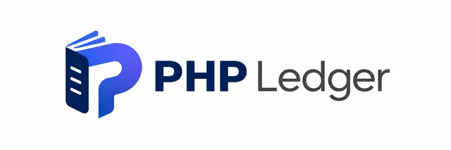
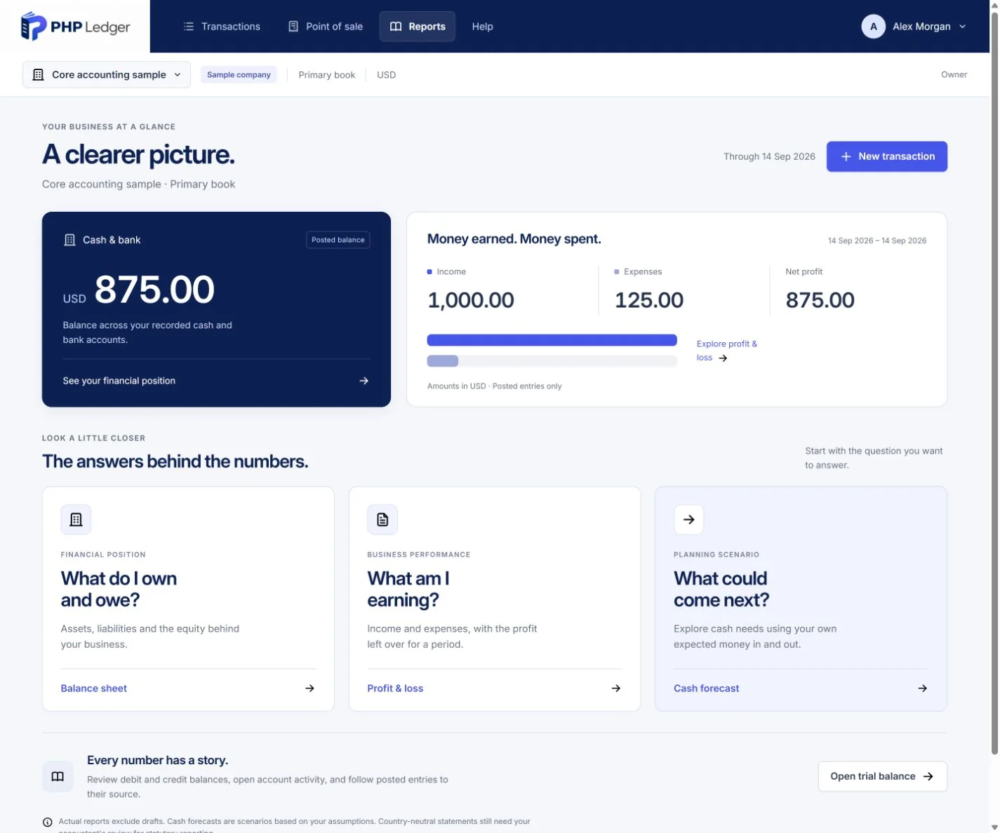
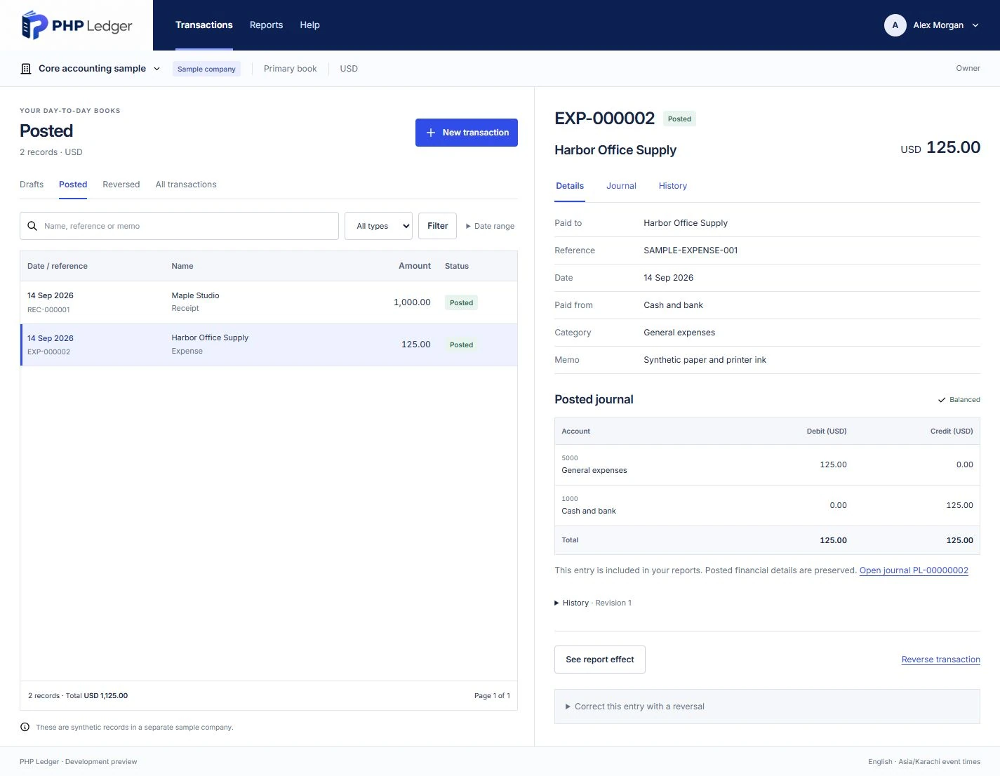
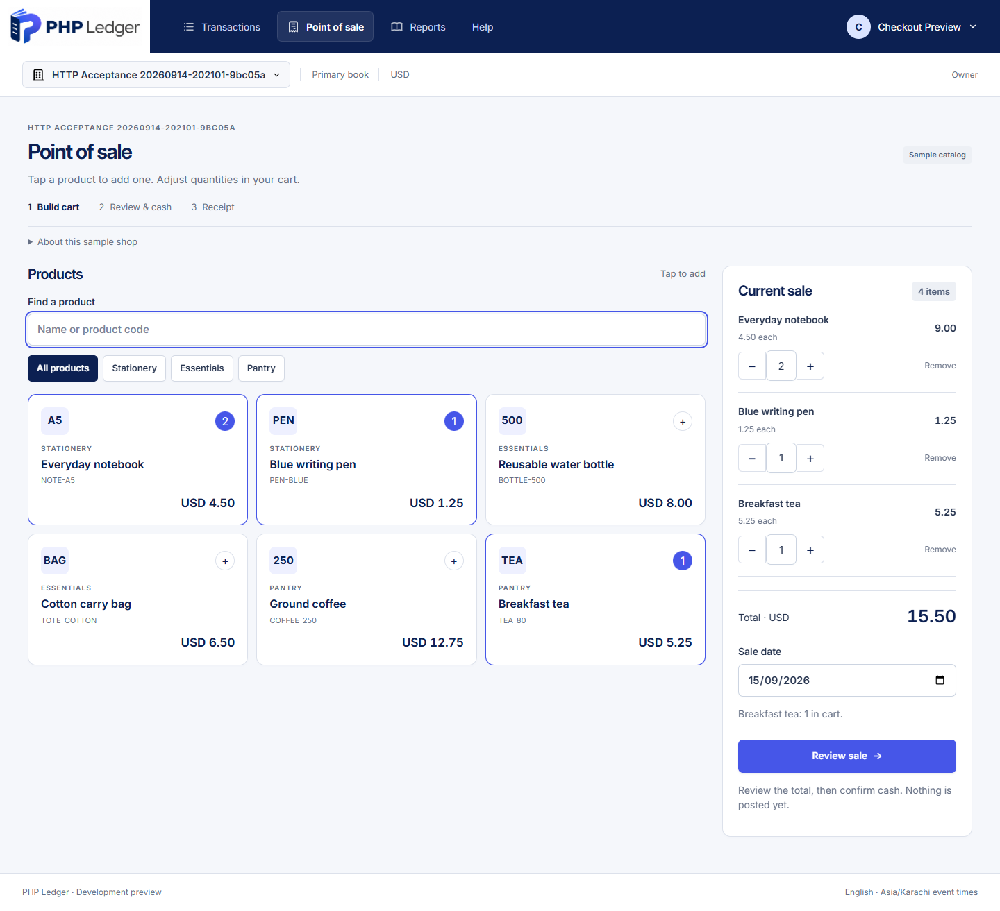

<p align="center">
  <a href="https://phpledger.com/">
    
  </a>
</p>

<h1 align="center">Open-source, self-hosted accounting and cash POS for small businesses</h1>

<p align="center">
  Built on PHP 8.2+ and MySQL 8.4. New code is AGPL-3.0-or-later licensed; a commercial licence is available. First stable release: 1.0.0.
</p>

<p align="center">
  
</p>

<p align="center">
  <a href="https://github.com/rmak78/phpledger/releases"><strong>Release downloads</strong></a> &nbsp; · &nbsp;
  <a href="https://phpledger.com/demo/">Try the demo</a> &nbsp; · &nbsp;
  <a href="https://github.com/rmak78/phpledger/wiki">Read the Wiki</a> &nbsp; · &nbsp;
  <a href="https://github.com/rmak78/phpledger/wiki/Roadmap">Roadmap</a> &nbsp; · &nbsp;
  <a href="https://github.com/rmak78/phpledger/discussions">Discussions</a>
</p>

---

## What is PHP Ledger

The `docs/` folder is tracked in the repository. Documentation links below point to files under `docs/`; new local research and design reviews are not release claims. Package builds still require the explicitly listed documentation inputs in `tools/package-files.json`.

PHP Ledger is open-source, self-hosted double-entry accounting software with a simple cash point of sale for small businesses, built on PHP 8.2+ and MySQL 8.4. **1.0.0** is the first stable release.

It records receipts and expenses as balanced double-entry journals, keeps posted entries immutable with linked reversals, and shows a trial balance, profit and loss, balance sheet and an entered cash scenario. A small cash point of sale posts sales through the same service and prints a receipt. Modern source lives in `www/phpledger`; the historical application is available only in Git history under its original terms.

**Requirements:** PHP 8.2+ (8.3 recommended) with BCMath, PDO, PDO MySQL, mbstring, sessions, cURL, OpenSSL and fileinfo, MySQL 8.4 with InnoDB, and HTTPS. Serve only `www/phpledger/public`. Installation is done in the browser at `/install`; no terminal access is required for setup. The PHP zip extension is required to use automatic in-browser updates; CLI installation and recovery remain available for operators who prefer them.

The accounting starter adds customer invoices, supplier bills, partial payments, credits and ageing to the base accounting core. Purchasing and shared Inventory are bundled optional modules. A manually configurable core tax engine supports inclusive or exclusive entered prices. All financial activity uses the same posting and reporting services.

**Release status:** **1.0.0**, published 18 September 2026, is the first stable release. The owner consolidated the locally implemented 0.6.1 workflow-recovery closure, the 0.7 browser installer and the 0.8 signed update/automatic-backup/recovery work into this single release and published it as the supported production scope. Automated test suites, fault-injection update/recovery tests, exact-artifact install/upgrade/recovery checks against the built package, and developer-operated browser checks back this release. Independent accounting review, independent security review, supervised pilots with a real month-end close, unfamiliar-operator installation observation, and restricted shared-host recovery certification have **not** happened; the owner published with these limits disclosed as post-release commitments, not as claims of completed review. See [Validation](docs/VALIDATION.md#100-publication--18-september-2026) and [Roadmap](docs/ROADMAP.md#current-delivery-contract-first-stable-10) for the exact evidence and open gates.

**Release signing:** the updater verifies publisher-signed release metadata against a key the operator pins out of band. The official publisher key had not been generated when 1.0.0 was published, so the 1.0.0 release carries a SHA-256 checksum but no signed update metadata; its fingerprint will be published in [docs/RELEASE-SIGNING.md](docs/RELEASE-SIGNING.md), the website and the Wiki once it exists, and later releases will ship signed metadata.

Every release, including previews and patch releases, must publish the application archive, its SHA-256 checksum and a matching versioned media kit. The kit contains factual announcement/press copy, guided experiments, FAQs, social/email drafts and verified screenshots from that release with captions and alt text. Attach it to the GitHub release, link it in the release notes and owner handoff, and verify its public download and checksum. A release is incomplete without its media kit. The [1.0.0 media kit](https://github.com/rmak78/phpledger/releases/download/v1.0.0/phpledger-1.0.0-media-kit.zip) is attached to the GitHub release; campaign publication remains a human decision.

Every release also reviews and updates the GitHub Wiki, repository About description, website URL and topics, README, release notes, version/package manifests, and affected website download and social/share metadata. Verify the public results and record each surface as updated or reviewed unchanged in the publication receipt and owner handoff. All surfaces must agree on shipped capabilities, version, download links and preview limitations.

## Current release: 1.0.0

The accounting starter, eleven-pack chooser, responsive shell, catalogue-led setup, browser installation, and signed automatic updates with backup and recovery are included in the published 1.0.0 release. In local Docker, sign in, open **Your businesses**, and use **Try a sample company** to provision only the selected synthetic book.

### Local test login

There is no shared development password. After the local database is healthy and migrated, create a synthetic owner account with the installer and keep the password in memory only:

```powershell
$testPassword = Read-Host 'Choose a local test password (12-72 characters)'
$testPassword | & 'C:\xampp\php\php.exe' www/phpledger/install/create-admin.php --email='ledger-test@example.invalid' --name='Local Ledger Tester' --password-stdin
Remove-Variable testPassword
```

Use that email and the password you entered at `http://127.0.0.1:18200/login`. The command requires the local database configuration and completed migrations; it does not send email or create a production account.

| Area | Included in 1.0.0 |
|---|---|
| Base accounting: AR and AP | Customer invoices, supplier bills, partial/final payments, linked credit notes, historical ageing and control-account reconciliation. Separate service modules are included in the required accounting core. |
| Purchasing | Optional module for purchase orders, partial goods receipts, later supplier bills, receipt matching, returns and received-but-unbilled reconciliation. Supplier balances always belong to AP. |
| Shared Inventory | Optional activation of products, one stock location, immutable movements, moving weighted-average valuation, counts and reviewed adjustments. Stock invoices issue goods and record their cost through the shared posting service. |
| Core tax engine | Manually configured tax codes, dated rate revisions, output/input tax accounts and owner-selectable tax-exclusive or tax-inclusive entry. Saved documents freeze their mode and tax snapshot; display separates net, tax and total. |
| Existing opening balances | Explicitly reviewed party/product mapping into the shared ledgers, reconciled to existing opening journal amounts without posting them twice. |
| Browser installation | Guarded `/install` wizard: host/database checks, the existing migration chain, first-account creation and business onboarding, without Composer, Node or a terminal. CLI installation remains available. |
| Signed automatic updates | Publisher-signed release packages, applied through the independent `/maintenance.php` operator interface, with pinned publisher-key verification and channel/version binding. |
| Automatic backup and recovery | Matched code, configuration, key and database backups are taken before an update is applied; a failed update automatically restores the matched backup. Verified in fault-injection testing, not yet on a restricted shared host. |

**Assurance status:** these capabilities pass automated and fault-injection tests and exact-artifact install/upgrade/recovery checks run by the development team; they have not yet been through independent accounting review, independent security review, a supervised pilot, unfamiliar-operator installation observation, or shared-host recovery certification. See [Validation](docs/VALIDATION.md#100-publication--18-september-2026).

Owners can hide AR/AP navigation without disabling accounting services or changing reports. Purchasing and Inventory use the existing module activation controls; historical records remain readable after disabling new operations. Quotes are preserved separately on `codex/quotes-plugin` and are excluded from this starter.

The 0.5.0-preview candidate adds eleven selectable synthetic businesses: Cedar Studio, Sunrise Garden Services, Willow Corner Shop, Harbour Trade, Harbor Supply Company, Cedar Table, Riverside Community Club, Meadow Training Pharmacy, Lantern Finch Jewelry Studio, Maple Bench Works and Wheel & Spoke Workshop. Each historical pack contains fixed 2024-2025 examples, an open 2026 practice year, durable source identities, a pinned digest and reconciled monthly checkpoints. Industry names describe teaching scenarios only; unsupported operational, regulatory and compliance features remain out of scope.

The candidate also carries `resources/coa/industry-profiles-0.5.0.json`, a research-backed vertical account vocabulary for all eleven samples. It improves the isolated sample chart labels and keeps distinctions such as food versus beverage, labor versus parts, raw material versus WIP versus finished goods, and earned versus unearned dues visible. Its illustrative codes are not statutory account numbers and it does not activate country tax rules.

**Boundaries:** no country tax rules or automatic rates, statutory forms/e-filing, batches/serials/expiry, landed cost, LC flows, multiple warehouses, advances/unapplied credits/refunds, automatic sends, bank feeds or public financial write API. Those remain later plugins or explicitly reviewed extensions. The existing cash POS showcase does not deduct stock from Inventory.

See [starter implementation and validation](docs/repository/sprint-06/ACCOUNTING-STARTER.md) and [release notes](resources/release/RELEASE-NOTES.md). Technical checks describe the tested candidate and do not alone establish production readiness.

## Who it is for

The public demo has eleven multi-year synthetic businesses and a separate, empty Accounting starter playground with prepared accounts, parties, a product and illustrative tax configuration. A visitor selects one sample; only that isolated company is provisioned, and trusted seed history is separate from the visitor's practice-record allowance.

PHP Ledger is country-neutral accounting software for small businesses, owners, bookkeepers, accountants and organisations managing multiple client companies. Pakistan is one intended regional direction, not the main market or the product's defining scope. Owner-equity reporting is a shared priority; partner capital, profit-sharing and drawings are planned examples that require the appropriate entity and accounting profile. Daily entry should work well on phones, with clear reporting and review on larger screens.

The application requires **PHP 8.2 or newer**; **PHP 8.3 is the recommended deployment version**. Dependencies resolve against the 8.2 floor. The [hosting and runtime record](docs/strategy/HOSTING-PHP-COMPATIBILITY.md) distinguishes tested PHP versions from unverified hosting plans. Urdu, Arabic/RTL, queued offline drafts, regional connectors including Pakistan FBR, native clients and later modules remain planned.

## What the working preview shows

[](docs/repository/assets/owner-overview-preview.webp)

*Actual development capture with fictional books. The sample records 1,000 in receipts and 125 in expenses, leaving 875 in the bank. Reports and POS remain development previews.*

> [!NOTE]
> **Evaluate the accounting core.** [Download 1.0.0](https://github.com/rmak78/phpledger/releases/tag/v1.0.0) with production dependencies and installation instructions. Install in the browser at `/install`, or follow the CLI steps. Follow opening, running and closing account balances; manage accounts; save, review, post and reverse general journals. Modern source lives in `www/phpledger`; historical code is retained only in Git history. Independent regional package validation and pilot usability review remain open post-release commitments.

## Explore the working preview

| Your task | What you can explore |
|---|---|
| **Start a business** | Company setup, a preliminary neutral account template and separately isolated sample companies. Reviewed regional template selection remains future work. |
| **Record the day** | Receipt/expense drafts, customer invoices, supplier bills, allocated payments, credits, clear posting and linked reversals. |
| **Work on the books** | Account creation, audited name/status changes and general-journal drafts with a separate posting review. Account administration is available in an installation; the public demo keeps it read-only. |
| **Understand the numbers** | Profit and loss, balance sheet, cash balance, trial balance and account statements with opening, running and closing balances, linked to their sources. |
| **Look ahead** | A cash scenario using the inflows and outflows you enter; assumptions remain visible. |
| **Try the counter** | Click-to-add sample products, quick cart controls, separate review/cash confirmation, a printable receipt and linked journal. |

<details>
<summary><strong>See the transaction and its accounting entry</strong></summary>

[](docs/repository/assets/expense-to-journal-preview.webp)

A saved draft has no effect on the books. Posting creates the balanced entry; a correction retains history through a linked reversal. This screenshot uses synthetic data from the working preview.

</details>

<details>
<summary><strong>See the cash POS preview</strong></summary>

[](docs/repository/assets/cash-pos-click-preview.png)

The owner-approved cash-sale layout: click a product to add one, adjust quantities in the cart, then review the sale before confirming cash. This actual capture contains an unposted synthetic cart. Stock deduction, COGS, tax, card processing and credit sales are not implemented by this showcase.

</details>

[**Open your sample company →**](https://phpledger.com/demo/)

No registration is needed. Each visitor gets separate synthetic books. Demo records reset hourly; destructive user actions are disabled. The [demo guide](https://github.com/rmak78/phpledger/wiki/Getting-Started) explains what to try and what is still in development.

## How it is built

The modern foundation uses **PHP 8.2+, MySQL 8.4/InnoDB and MeekroDB** in BixiSoft's lightweight modular PHP structure. Server-rendered screens and small JavaScript modules keep the application approachable to maintain.

Every financial write follows the same posting path: exact decimal amounts, company/book permissions, atomic transactions, duplicate protection, period controls and immutable posted history. Local checks cover these behaviors; they do not replace independent security, accounting or usability review. [Explore the architecture →](https://github.com/rmak78/phpledger/wiki/Architecture)

Developers can work with the modern source using the [local development guide](docs/DEVELOPMENT.md). Serve only `www/phpledger/public`; the repository root is not a web document root. Source availability is separate from a tested installable release.

### Currencies and regions

The current preview is English and uses one base currency per book. Choose **USD, EUR, GBP, PKR, INR, MYR, BDT, LKR, NPR or SGD**. Event times are stored in UTC and shown in the terminal's timezone; accounting dates keep their meaning.

The accounting core is country-neutral. Pakistan, the UK, UAE, Saudi Arabia, Oman, Singapore, Malaysia, Sri Lanka and Bangladesh are regional research or connector directions, not a fixed definition of the product's audience. Pakistan FBR is one planned connector alongside other tax/e-invoicing integrations. Currency selection does not activate country accounting or tax rules. Reviewed translations, flexible formats and foreign-exchange accounting remain future capabilities. [Countries and currencies →](https://github.com/rmak78/phpledger/wiki/Countries-and-Currencies)

Early [tax research](docs/tax/README.md) covers eight countries and seven business types. Its 81 candidate regimes are **disabled and unreviewed**; they do not calculate taxes or establish eligibility. The [accounting rule register](docs/accounting/CORE_RULE_REGISTER.md) connects the core's controls with ICAP, ICMAP and ACCA guidance and records the remaining review gates.

## Read connections and richer samples

Release **0.2.1-preview** combines scoped read API/MCP, existing-user OAuth/Connections and server-side tables with four synthetic businesses: service agency, retail shop, seasonal business and distributor. Each has 74 sources, closed 2024–2025 history, an open 2026 practice period and three editable drafts. [Reporting guides](https://phpledger.com/guides/) explain daily checks, monthly closing and quarterly/yearly review. [Setup recipes and client matrix](docs/INTEGRATIONS.md) distinguish actual native-client results from pending compatibility checks. Financial commands remain future work.

## Where we go from here

**1.0.0 is published as the first stable release.** The owner consolidated 0.6.1 workflow recovery, 0.7 browser installation and 0.8 signed automatic backup/update/recovery into this release rather than sequencing them as separate previews. Independent accounting review, independent security review, supervised pilots with a real month-end close and the previously planned release-candidate acceptance period continue as post-release commitments, not as claims already satisfied. Next: **1.0.x** production fixes and compatibility improvements, **1.1** reviewed Urdu/RTL plus installer distribution channels (Softaculous/Installatron, published containers/packages), and **1.2** reviewed Arabic/RTL and demand-led reporting refinements.

| Next | Outcome |
|---|---|
| **Independent review and pilots (post-release)** | Independent accounting review, independent security review, and 2–3 supervised pilots with a 30-day, month-end-close cycle, continue after publication rather than gating it. |
| **1.0.x** | Production fixes and compatibility improvements based on real-world use of 1.0.0. |
| **1.1: Urdu/RTL and distribution channels** | Reviewed Urdu/RTL translation, plus installer distribution channels (Softaculous/Installatron, published containers/packages). |
| **1.2: Arabic/RTL** | Reviewed Arabic/RTL translation and demand-led reporting refinements. |

The core must work independently of add-ons. Shop and restaurant interfaces will share checkout and accounting services while providing their own operational workflows. Observed usability, package validation and an explicit supported scope remain release gates. [Module build order and completion gates →](docs/MODULE-ROADMAP.md)

Restaurant, pharmacy, club, trader, distributor, shop and workshop scenarios inform the longer-term product. **Scan document** and AI extraction come later, with human review before saving or posting.

[**Full roadmap**](https://github.com/rmak78/phpledger/wiki/Roadmap) · [**Package scope**](https://github.com/rmak78/phpledger/wiki/First-Package) · [**Release validation**](docs/repository/sprint-05/PREVIEW-0.2.1-VALIDATION.md)

## How to get involved

We welcome thoughtful feedback from business owners, bookkeepers, accountants, designers and developers. Describe the task you need to finish, show a synthetic example, and tell us where the flow gets in your way.

- **Ask a question:** [Discussions Q&A](https://github.com/rmak78/phpledger/discussions/categories/q-a) for usage and installation help.
- **Report a bug:** [open an issue](https://github.com/rmak78/phpledger/issues) with synthetic data and sanitized logs; [SUPPORT.md](SUPPORT.md) explains what to include.
- **Review accounting or contribute:** start with the [contributor guide](https://github.com/rmak78/phpledger/wiki/Contributing-and-Support) or a [good first issue](https://github.com/rmak78/phpledger/issues?q=is%3Aopen+label%3A%22good+first+issue%22).
- **Report a security problem privately:** see [SECURITY.md](SECURITY.md).
- **Discuss a pilot or setup support:** [rmak78@gmail.com](mailto:rmak78@gmail.com).
- **Connect on LinkedIn:** [Rana Mansoor Akbar Khan](https://pk.linkedin.com/in/rmak78).

**Location:** Innovista Chenab, Arcade Plaza, Sector C, DHA Multan, Punjab 60000, Pakistan.

**Companies that support our open-source initiative:** [BixiTech](https://www.bixitech.com/) · [BixiSoft](https://bixisoft.com/) · [BrownBag](https://brownbag.pk/) · [Agency75](https://agency75.com/).

The project-owned core and documentation use [AGPL-3.0-or-later](LICENSE), with a separate commercial licence available. Self-hosting is free without licence keys or licensing-server calls. Published pre-adoption 0.1.0 through 0.1.5 previews retain MIT. See [Licensing policy](docs/LICENSING-POLICY.md). [Licence scope](LICENSE-SCOPE.md) preserves separate terms for historical code, dependencies, fonts, datasets and company marks; the legacy application's provenance is not resolved by this grant, and MeekroDB keeps its LGPLv3 terms. No stable-release, jurisdiction-compliance or support-response guarantee is implied by the preview.

---

<p align="center">
  <a href="https://phpledger.com/">PHP Ledger</a> &nbsp; · &nbsp;
  <a href="https://github.com/rmak78/phpledger/wiki">Documentation</a> &nbsp; · &nbsp;
  <a href="https://github.com/rmak78/phpledger/wiki/Roadmap">What's next</a>
</p>
