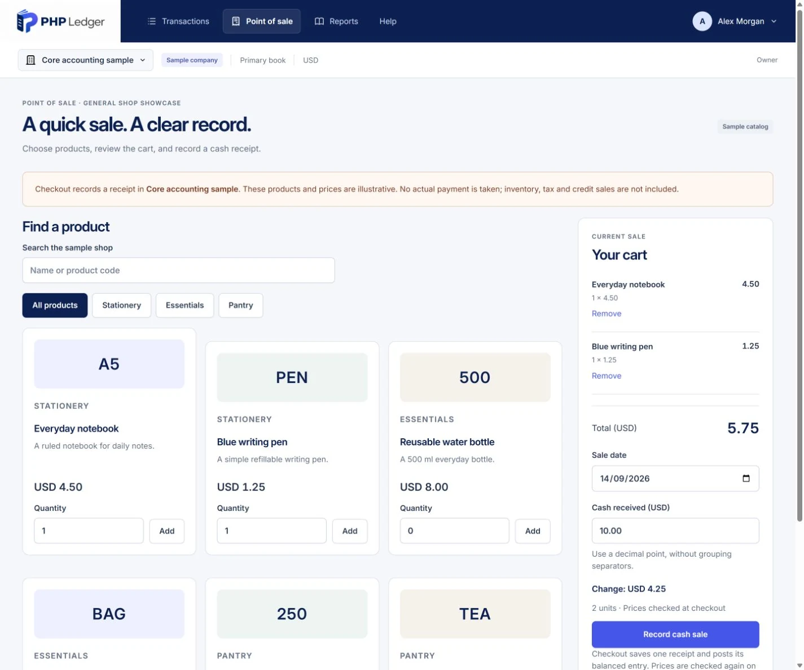

  

<h1 align="center">Clear books. Confident decisions.</h1>

  Accounting for the people running the business. 
  Built for owners, accountants and bookkeepers. Designed to live on your own hosting.

  

  <a href="https://phpledger.com/demo/"><strong>Try the demo</strong></a> &nbsp; · &nbsp;
  <a href="https://github.com/rmak78/phpledger/wiki">Read the Wiki</a> &nbsp; · &nbsp;
  <a href="https://github.com/rmak78/phpledger/wiki/Roadmap">Explore the roadmap</a> &nbsp; · &nbsp;
  <a href="https://github.com/rmak78/phpledger/issues">Share feedback</a>

---

## From the day's work to a clearer picture

Record an expense. Follow its balanced entry. See what changed in the business.

PHP Ledger is being rebuilt around that connected journey: useful daily tasks for an owner, traceable records for an accountant, and a practical cash register for a small shop. The goal is a welcoming first five minutes and dependable books over the years that follow.

*Actual development capture with fictional books. The sample records 1,000 in receipts and 125 in expenses, leaving 875 in the bank. Reports and POS are being refined for the first package.*

> [!NOTE]
> **A revival in progress.** The demo is a development preview. This repository's default branch still preserves the earlier application; the modern installable source package is being prepared. Read [Getting started](https://github.com/rmak78/phpledger/wiki/Getting-Started) before choosing an installation path.

## Explore the working preview

| Your task | What you can explore |
|---|---|
| **Start a business** | Company setup, a preliminary account template and an isolated sample company. |
| **Record the day** | Receipt and expense drafts, clear posting, balanced journals and linked reversals. |
| **Understand the numbers** | Profit and loss, balance sheet, cash balance, account activity and trial balance, with source drill-down. |
| **Look ahead** | A cash scenario using the inflows and outflows you enter; assumptions remain visible. |
| **Try the counter** | A small illustrative catalog, cash tender and change, a printable receipt and the linked journal. |

<strong>See the transaction and its accounting entry</strong>

A saved draft has no effect on the books. Posting creates the balanced entry; a correction retains history through a linked reversal. This screenshot uses synthetic data from the working preview.

<strong>See the cash POS preview</strong>

An early working cash-sale flow, with an illustrative unposted basket. A more compact register and clearer payment journey are planned. Stock deduction, COGS, tax, card processing and credit sales are not implemented by this showcase.

[**Open your sample company →**](https://phpledger.com/demo/)

No registration is needed. Each visitor gets separate synthetic books. Demo records reset hourly; destructive user actions are disabled. The [demo guide](https://github.com/rmak78/phpledger/wiki/Getting-Started) explains what to try and what is still in development.

## Built with care, kept understandable

The modern foundation uses **PHP 8.5, MySQL 8.4/InnoDB and MeekroDB** in BixiSoft's lightweight modular PHP structure. Server-rendered screens and small JavaScript modules keep the application approachable to maintain.

Every financial write follows the same posting path: exact decimal amounts, company/book permissions, atomic transactions, duplicate protection, period controls and immutable posted history. Local checks cover these behaviors; they do not replace independent security, accounting or usability review. [Explore the architecture →](https://github.com/rmak78/phpledger/wiki/Architecture)

### A regional product, one clear foundation

The current preview is English and uses one base currency per book. Choose **USD, EUR, GBP, PKR, INR, MYR, BDT, LKR, NPR or SGD**. Event times are stored in UTC and shown in the terminal's timezone; accounting dates keep their meaning.

Pakistan is first for accounting-framework research, followed by the UK and UAE. Currency selection does not activate country accounting or tax rules. Reviewed translations, flexible date/number formats and fixed, fetched or manually overridden exchange rates are part of the future path. [Countries and currencies →](https://github.com/rmak78/phpledger/wiki/Countries-and-Currencies)

## Where we go from here

| Next | Outcome |
|---|---|
| **First installable package** | Refined reports and POS, clear installation, a tested upgrade/recovery path and explicit release limits. |
| **Accounting MVP and pilots** | Receivables, payables, opening balances, historical imports, reconciliation and reviewed period-end reporting. |
| **Regional accounting and ERP** | Explainable multi-book differences, reviewed country adapters, inventory/purchasing, production POS and distribution. |

Restaurant, pharmacy, club, trader, distributor, shop and workshop scenarios inform the longer-term product. **Scan document** and AI extraction come later, with human review before saving or posting.

[**Full roadmap**](https://github.com/rmak78/phpledger/wiki/Roadmap) · [**First-package scope**](https://github.com/rmak78/phpledger/wiki/First-Package) · [**Sprint 03 progress**](https://github.com/rmak78/phpledger/milestone/4)

## Help shape PHP Ledger

We welcome thoughtful feedback from business owners, bookkeepers, accountants, designers and developers. Describe the task you need to finish, show a synthetic example, and tell us where the flow gets in your way.

- **Explore and report:** [open an issue](https://github.com/rmak78/phpledger/issues).
- **Review accounting or contribute:** start with the [contributor guide](https://github.com/rmak78/phpledger/wiki/Contributing-and-Support).
- **Discuss a pilot or setup support:** [rmak78@gmail.com](mailto:rmak78@gmail.com).

**Supporting the initiative:** BixiTech · BixiSoft · Agency75.

The product direction is open-source software and modules, supported by paid setup, training and support on customer-owned hosting. **Project-license selection and legacy provenance review remain open.** No stable-release, jurisdiction-compliance or support-response guarantee is implied by the preview.

---

  <a href="https://phpledger.com/">PHP Ledger</a> &nbsp; · &nbsp;
  <a href="https://github.com/rmak78/phpledger/wiki">Documentation</a> &nbsp; · &nbsp;
  <a href="https://github.com/rmak78/phpledger/wiki/Roadmap">What's next</a>

