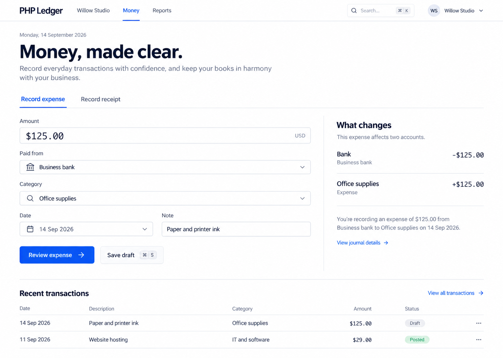
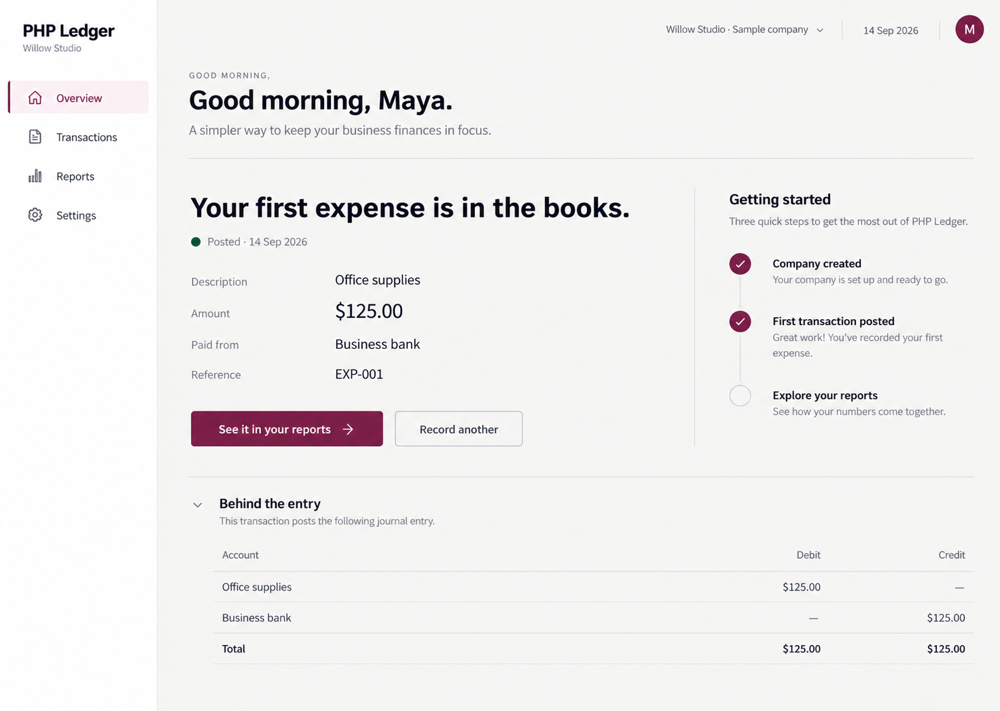
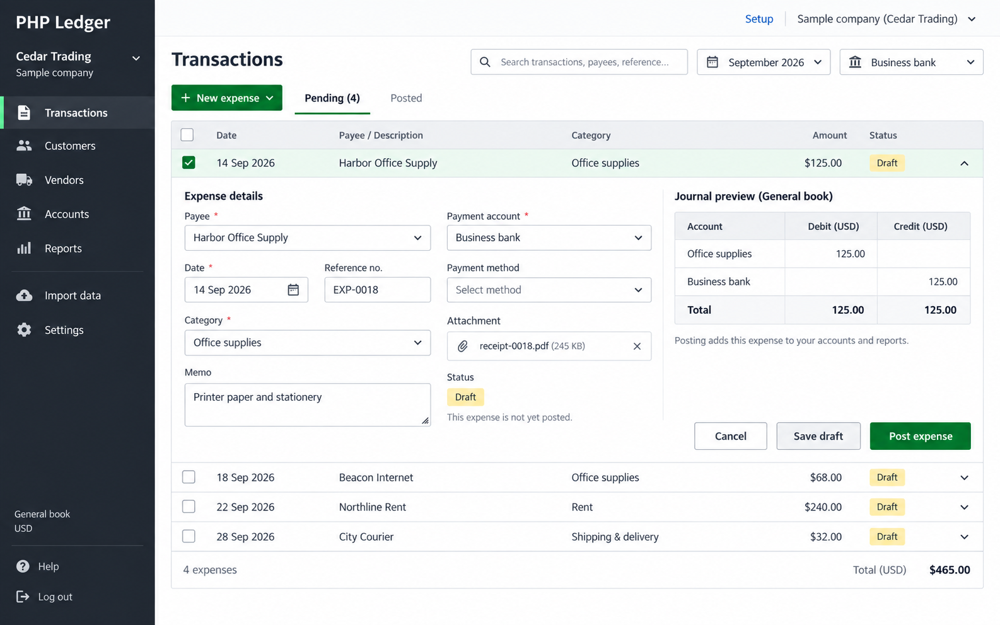
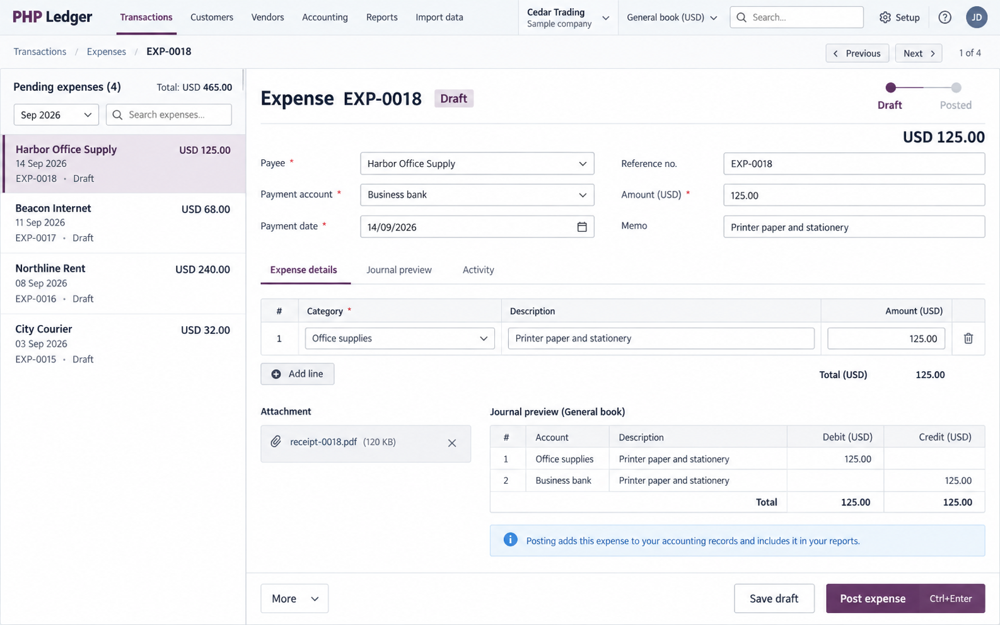
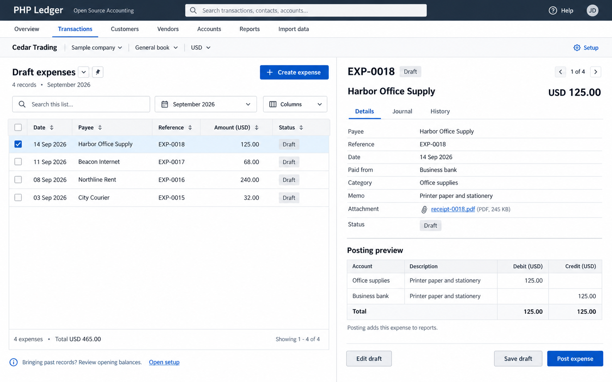

# Independent review of the six layouts

Lead completion note: all six branded outputs were subsequently inspected. Directions 5 and 6 retain the intended document-editor and list/detail structures, the four expense amounts total USD 465.00, and their selected-record journal previews balance at USD 125.00 each side. The final sixth image incorporates the later color and Inter direction visually; it is not a rendered-font or interaction test. The original workflow refinements below remain required.

Reviewed 2026-09-14. **Direction 6, Review Console, is selected for refinement.** Following this independent recommendation, the lead selected it under the user's explicit delegation; the decision is recorded in [Design](../../DESIGN.md). It has the strongest combination of a current professional appearance, readable records, visible company context, and a useful relationship between a transaction list and its details. Direction 5 is the closest alternative, especially for editing longer documents.

This is an independent visual review requested by the user. It is not an implementation, participant study, or approval of unbuilt behavior. The initial evidence is the six original concept images linked below and the supplied [logo](logo-reference.png). The original palettes are excluded from the ranking because all six are being revised to the same navy, blue, and violet brand. A subsequent check of branded directions 1–4 is recorded below; branded 5–6 were not yet available to this reviewer at that check.

The later [designer feedback](DESIGNER-FEEDBACK.md) recommends retaining and refining the book/P mark. The designer's exact navy `#0C2052` and charcoal `#424242` supersede the first concept approximations for implementation. [Brand and typography guidance](../../BRAND.md) records the lead's Inter interface choice, separate from the wordmark; font-file and rendered checks remain governed by that record. The raster concepts do not demonstrate those exact font specifications.

## Decision criteria

The primary audience is SME owners, accountants, and bookkeepers. The product must support a quick first transaction, reliable repeated work, historical imports, and eventual operational modules. The comparison considers task hierarchy, useful information density, record context, state clarity, business identity, and likely adaptation to smaller screens. Likely behavior is explicitly an inference from the composition.

**Most current visual structure:** 6, then 5, 4, 2, 3, 1. This is a design judgment, not a measured score. Directions 1 and 3 depict onboarding and confirmation, so their lower ranking as the main application shell does not mean those tasks are unimportant.

| Direction | Strongest advantage | Main drawback | Best role |
|---|---|---|---|
| 1. Guided Start | Clear steps, labeled fields, one obvious continuation | Oversized headline and sample invitation use more space than the actual setup; decorative treatment resembles a landing page | A simplified onboarding flow within the chosen system |
| 2. Ledger Desk | Friendly expense form and plain-language explanation of the accounting effect | Large promotional heading, sparse record list, and limited navigation do not establish a scalable working environment | A focused first-transaction form |
| 3. Calm Overview | Posted state, source reference, and next report action are easy to locate | Greeting and celebration dominate; the same state repeats through the checklist and journal | A compact, temporary first-success state |
| 4. Transaction Workbench | Table, filters, contextual fields, totals, and posting action support immediate work | The expanded record pushes other rows apart; amount is not visibly editable; checkboxes blur bulk selection and inspection | Reconciliation or short inline corrections |
| 5. Accounting Records | Document title, line items, draft state, and persistent actions make a strong editing surface | Duplicate amount entry and repeated journal access add cognitive load; narrow left list loses comparison columns | Full-document editing, particularly multi-line documents |
| 6. Review Console | The list stays visible beside one record; search, filters, totals, and context create a coherent working tool | Three header strips, repeated state, and redundant save/journal content need simplification | **Main application direction** |

## Inspected images and findings

### 1. Guided Start — useful journey, unsuitable main shell

The step indicator and explanatory field labels support a novice's first setup. The logo/company block has an obvious place in the sidebar. However, the large headline and exploration panel compete with a short form. The screenshot also calls the existing company a demo while offering to open a sample company, which needs clearer state wording. Smaller-screen stacking appears plausible but is untested.

### 2. Ledger Desk — approachable entry, limited working context

The amount leads the form and the adjacent "What changes" explanation connects an expense to its effect. Those are useful owner-facing decisions. The large "Money, made clear" area and two-row recent list reduce daily scanning capacity. Company identity appears in two places in the top bar. Keyboard shortcut labels are only illustrations; operation and platform-specific labels are unverified.

### 3. Calm Overview — clear success, too much ceremony

The posted expense is tied to a reference and a direct report action. That is good instructional sequencing. Repeated greetings, first-expense messaging, and checklist content will become noise after the first session. Company identity is repeated in the sidebar and top bar. This screen can inform a first-use confirmation, but should not remain the everyday overview.

### 4. Transaction Workbench — efficient context, unstable list shape

The table has useful columns and a visible total; editing in context avoids an apparent navigation jump. The open row consumes most of the table height, so reviewing many records would move surrounding rows substantially. The marked checkbox also looks like the trigger for opening the row, which conflicts with ordinary bulk selection. The amount requires a clear authoritative field, and the internet expense needs the correct sample category. Navigation has room for a business logo but should avoid a large decorative brand block.

### 5. Accounting Records — strong document editor

The layout is coherent around one document, with line-level detail, a status path, previous/next controls, and a stable action footer. It is the strongest candidate for longer invoices, bills, and other line-based documents. The screenshot repeats the amount in an editable header and editable line, without showing which controls the other. Journal access appears both as a tab and a visible panel. Both need one clear model. Its packed top navigation would need an explicit overflow/module strategy as the ERP grows.

### 6. Review Console — preferred foundation

The transaction list and selected document remain visible together. Amounts align, record count and total are present, and search/filter controls are attached to the list they affect. Company and book context have deliberate places. These observations make it the strongest base for imports, reconciliation, and repeated review, although those workflows are not shown or proven. The logo's structured book/P mark fits a restrained, orderly interface better than a large decorative hero.

## Five required refinements for direction 6

1. **Reduce the header burden.** Use compact product/navigation chrome and a clear company/book context near the task heading. Provide a controlled module switcher or overflow as modules grow. Allow a business logo in the identity area; keep optional customization separate from the first required setup steps. The PHP Ledger mark must retain its own colors even when a business accent is chosen.
2. **Separate inspection, editing, and selection.** Clicking a record opens its details; a checkbox selects it for an explicit bulk action. Mark the current record independently. Read mode should offer "Edit draft" and a valid posting action. Show "Save draft" only for editable work, and protect unsaved changes when moving to another record. A posted entry must expose its reference and permitted reversal path.
3. **Remove duplicate information and simplify the first task.** Keep one record status and one accounting-detail location. Default to concise plain-language impact, with journal detail available when needed. Let a new owner create an expense in a focused editor with sensible defaults; do not require understanding a review console before recording the first transaction. Keep the same components and navigation language throughout.
4. **Design narrower and keyboard paths explicitly.** A side-by-side desktop layout should become list → detail on narrow screens, preserving filters, selected record, and return position. The create/edit form needs adequate width, a deliberate focus order, visible focus, labeled controls, and an error summary that retains values. Dense tables must have usable touch targets and a defined overflow strategy. None of these properties can be confirmed from the image.
5. **Make imports and accounting readiness understandable.** "Import data" must lead to mapping, row errors, duplicate review, totals, and explicit confirmation. Keep sample/real company identity visible. Explain unresolved opening balances before reporting an existing business as ready. Future book controls must follow the approved book definition; a dropdown alone must not imply multi-book support.

## Brand and marketing conclusion

Use direction 6 with the default PHP Ledger navy/blue/violet identity in the public demo, website, and new installations. In a customized workspace, a business logo and controlled accessible accent can provide ownership while a subtle PHP Ledger mark remains. Keep the shared layout, typography, and financial-state meanings consistent. This is a product recommendation; no evidence here proves that a fixed palette or a logo placement improves conversion or retention.

## Evidence limits and change record

### Subsequent branded-image check

The reviewer visually inspected [branded 1](01-guided-start.png), [branded 2](02-ledger-desk.png), [branded 3](03-calm-overview.png), and [branded 4](04-transaction-workbench.png) after generation. Their principal layout, task content, and amounts remain recognizable. The horizontal mark/wordmark fits the light header areas without visible clipping, and no major rebrand-induced layout defect was observed at the supplied image size.

Branded 3 changes the original green "Posted" dot to blue, the same family used for navigation and primary actions. Its text label remains present, but this is a reminder to define financial-state colors deliberately in the implementation rather than allowing brand recoloring to determine them. Branded 4 retains its earlier amount-entry and sample-category issues; the recolor does not resolve them. Branded 1 retains a large logo area and decorative treatment by design. These findings do not change the selection of direction 6.

Branded 5–6 still require the lead's final image inspection. This check does not verify production logo fidelity at small sizes, exact color tokens, font loading, responsive behavior, or accessibility.

- Changed file: `docs/design/brand/REVIEW.md` only.
- Inspected all six original images and the supplied logo locally using the image viewer. No browser application flow was available in these static artifacts; none was tested.
- Read `README.md`, `docs/ARCHITECTURE.md`, `docs/ROADMAP.md`, `docs/DESIGN.md`, `docs/BRAND.md`, `docs/PRODUCT_BRIEF.md`, and the later `DESIGNER-FEEDBACK.md`; applied the Product Design audit framework as a bounded visual critique. No Google Drive documents were read and no competitor research was repeated.
- Migrations: no. Schema changed: no. Raw secrets exposed: no. External/live calls: no. Production changed: no.
- Markdown and existing image paths were checked. No executable code changed; PHP/JavaScript lint and application tests are not applicable to this review.
- Contrast of actual rendered controls, keyboard operation, screen-reader semantics, loading/error/empty states, responsive layouts, small-logo legibility, and observed usability remain unverified. The five-minute setup and ten-minute first-outcome targets still require representative participants.
