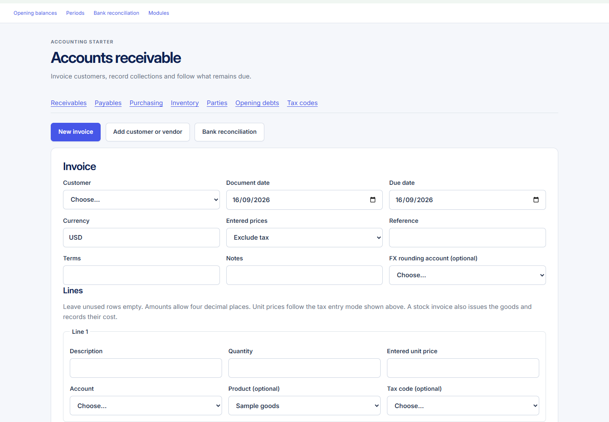
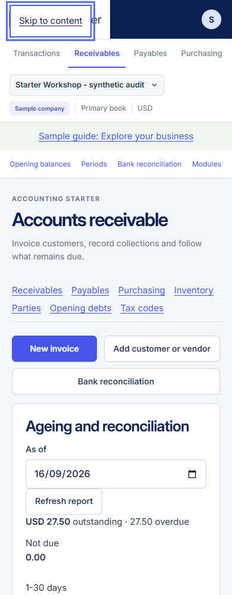

# Operations audit: AR/AP, parties, Purchasing and Inventory

**Status: observed local UX findings and proposed changes; no runtime changes.** Captured 16 September 2026, Asia/Karachi, using the authorized isolated Playwright session `ux-operations` at local port 18211. Only **Starter Workshop — synthetic audit**, company/book 822, was selected. The session was independent of the other audit lanes.

## Overall assessment

The starter exposes the necessary accounting actions and makes balances traceable. The current screens ask users to work through long combined forms and reports, with accounting setup choices mixed into everyday entry. The highest-priority confirmed issue is the domestic payment form: it requires FX gain and loss accounts even for a USD payment against a USD invoice.

This is a combined usability and limited accessibility audit, not a new financial correctness test or a compliance assessment. Product Design's audit and Playwright skills guided current-run capture and inspection. No financial POST was submitted, no customer/provider was contacted, and no application, schema or migration file changed.

### User tasks

1. Find an invoice, review it and collect part of its outstanding amount.
2. Find a supplier bill and understand what has been paid and what remains.
3. Add a customer/vendor without making unnecessary accounting setup decisions.
4. Order goods, receive a partial delivery, inspect bill matching and choose the correct return path.
5. Find a product, understand its stock and source movements, and prepare a stock count.

The fixture contains draft invoice 194, partially paid invoice 193, partially paid bill 192, purchase order 42, receipt 62 and product 108. It demonstrates AR remaining **27.50**, AP remaining **43.00**, stock quantity **4**, carrying value **40.00**, and zero displayed control differences. These values describe this synthetic fixture, not a live business.

## 1. Evidence and capture quality

- **48 accepted original screenshots:** 45 full-page captures across 15 states at **1440, 768 and 390px**, plus three focused viewport captures. Every accepted image was opened and inspected.
- Full-page PNG dimensions were checked against the reported DOM width/height; all 45 matched. None had document-level horizontal overflow or a captured PHP fatal/warning state. Several internal tables deliberately overflow their containers.
- Accepted images were copied byte-for-byte from `output/playwright/ux-audit` into [evidence](evidence/). [The manifest](evidence/30-operations-manifest.json) records source paths, dimensions, URLs and SHA-256 hashes. No screenshot was cropped, composited, recoloured or edited.
- An initial expanded-receipt capture painted an offscreen fixed skip link inside the long screenshot because the page was scrolled. DOM inspection showed the link at `y=-80`, unfocused. That artifact was rejected; the state was captured again from the top and inspected. It is **not** reported as an application defect.
- Capture crossed UTC midnight. Earlier default dates show 15 September and later ones 16 September; the authored documents and financial records did not change.

### Screens, actions and health

“Friction” means the state was reachable but imposed avoidable effort. “High friction” identifies a concrete obstruction or a long/confusing primary task. The three links in each row open the original full-page evidence.

| Step | Task/state and route | Observed health | Desktop / tablet / mobile |
|---|---|---|---|
| 1 | AR register, `/ar` | Friction: clear balance/actions; register follows a large report | [1440](evidence/30-ar-list-1440.png) · [768](evidence/30-ar-list-768.png) · [390](evidence/30-ar-list-390.png) |
| 2 | New invoice, `/ar?new=1` | High friction: five fixed empty line groups; no visible running total | [1440](evidence/30-ar-new-1440.png) · [768](evidence/30-ar-new-768.png) · [390](evidence/30-ar-new-390.png) |
| 3 | Draft review, `/ar?id=194` | Friction: clear total and edit/post actions; domestic rate field and repeated reports | [1440](evidence/30-ar-draft-1440.png) · [768](evidence/30-ar-draft-768.png) · [390](evidence/30-ar-draft-390.png) |
| 4 | Posted invoice/receipt form, `/ar?id=193` | High friction: remaining amount clear; unnecessary required FX choices | [1440](evidence/30-ar-posted-1440.png) · [768](evidence/30-ar-posted-768.png) · [390](evidence/30-ar-posted-390.png) |
| 5 | AP register, `/ap` | Friction: same report-before-register hierarchy | [1440](evidence/30-ap-list-1440.png) · [768](evidence/30-ap-list-768.png) · [390](evidence/30-ap-list-390.png) |
| 6 | Posted bill/payment form, `/ap?id=192` | High friction: balance clear; required FX choices and weak purchase context | [1440](evidence/30-ap-bill-1440.png) · [768](evidence/30-ap-bill-768.png) · [390](evidence/30-ap-bill-390.png) |
| 7 | Party register, `/parties` | Friction: one shared record is clear; roles hidden to the right on mobile | [1440](evidence/30-parties-1440.png) · [768](evidence/30-parties-768.png) · [390](evidence/30-parties-390.png) |
| 8 | New party, `/parties?new=1` | Friction: labels present; basic roles follow advanced account choices | [1440](evidence/30-party-form-1440.png) · [768](evidence/30-party-form-768.png) · [390](evidence/30-party-form-390.png) |
| 9 | Purchasing register, `/purchasing` | Friction: order list follows receipts/reconciliation | [1440](evidence/30-purchasing-list-1440.png) · [768](evidence/30-purchasing-list-768.png) · [390](evidence/30-purchasing-list-390.png) |
| 10 | Order/partial receiving, `/purchasing?id=42` | Friction: quantities clear; GRNI account and rate interrupt receiving | [1440](evidence/30-purchase-order-1440.png) · [768](evidence/30-purchase-order-768.png) · [390](evidence/30-purchase-order-390.png) |
| 11 | Expanded receipt and return, same route | High friction: ineligible unbilled return option is the default | [1440](evidence/30-purchase-receipt-1440.png) · [768](evidence/30-purchase-receipt-768.png) · [390](evidence/30-purchase-receipt-390.png) |
| 12 | New order, `/purchasing?new=1` | High friction: five fixed lines; unit-price tax basis is not adjacent | [1440](evidence/30-purchase-new-1440.png) · [768](evidence/30-purchase-new-768.png) · [390](evidence/30-purchase-new-390.png) |
| 13 | Inventory valuation/movements, `/inventory` | Friction: reconciliation visible; internal IDs and catalogue below reports | [1440](evidence/30-inventory-1440.png) · [768](evidence/30-inventory-768.png) · [390](evidence/30-inventory-390.png) |
| 14 | Product details, `/inventory?id=108` | Friction: product maintenance precedes stock actions | [1440](evidence/30-inventory-product-1440.png) · [768](evidence/30-inventory-product-768.png) · [390](evidence/30-inventory-product-390.png) |
| 15 | Expanded stock count, same route | Friction: current stock/reason visible; no adjustment preview | [1440](evidence/30-inventory-count-1440.png) · [768](evidence/30-inventory-count-768.png) · [390](evidence/30-inventory-count-390.png) |
| 16 | Select product in unsaved invoice line | High friction confirmed: product changes, known defaults stay blank | [Desktop viewport](evidence/30-ar-product-selected-1440.png) · [Mobile viewport](evidence/30-ar-product-selected-390.png) |
| 17 | Keyboard skip link, `/ar` | Healthy in this check: visible focus; Enter focuses `main` | [Mobile viewport](evidence/30-keyboard-skip-390.png) |

## 2. Confirmed strengths

- Company, sample status, book and currency remain visible in the shared shell. The selected business is identifiable across all captured workflows.
- Draft invoices separate **Edit draft** from **Post invoice**. Posted documents show net, tax, total and remaining amount outside the line table, so the headline amounts survive mobile table overflow.
- Posted invoice/bill activity links to underlying journals and records allocations separately from recognition. The sample balances and displayed control differences are consistent across captured list/detail views.
- PO 42 shows **10 ordered, 6 received and 4 unreceived**. The receive form asks for quantities received now and includes physical-count confirmation. The new-order explanation correctly distinguishes an order from an accounting posting.
- Receipt 62 exposes its matched supplier bill and quantities. Stock lists show the issue and receipt separately and link to their source journals.
- Manual stock guidance directs ordered goods and supplier returns to Purchasing. Counts require a reference and reason; product type/unit/stock account are visibly protected after use.
- All inspected visible form controls had associated labels. All nine DOM-inspected routes had one `main` and one `h1`. The keyboard skip link visibly received focus, then moved focus into `main` on Enter.

## 3. Ranked findings

### P1 — Remove mandatory FX choices from domestic payments

**Steps 4 and 6.** Invoice 193 and bill 192 use USD in a USD book. Both settlement forms display required gain/loss selectors. On invoice 193, the auditor selected the cash account and entered a payment reference without submitting. Native `checkValidity()` then failed **only** for `gain_account_id` and `loss_account_id`, both with “Please select an item in the list.” See [the captured DOM validation](evidence/30-payment-validation.json).

This makes a simple customer receipt depend on choosing two accounting accounts that the transaction does not need. It also encourages arbitrary choices merely to proceed. Show FX fields only when the currency/rate outcome requires them; keep any legitimate company defaults and server validation authoritative. Do not weaken actual FX accounting checks.

### P1 — Make document lines start from the product and show their totals

**Steps 2, 12 and 16.** New invoices render five blank groups of six fields. A mobile new-invoice page is **6269px** high; the new-order page is **4256px**. There is no visible Add line control or running document total before saving.

Selecting **Sample goods** left description, quantity, unit price and account blank. The product page already displays selling price **25.0000** and its income account. The supplementary capture and DOM check confirm the missing assistance; the form was not saved.

Start with one useful line, offer Add line, prefill appropriate product defaults with an explicit override, and keep exact net/tax/total visible. Preserve entered values on validation failure. Any preview must share the server's decimal and tax rules; a second floating-point calculator would introduce another problem.

### P1 — Put daily document and stock tasks before reports and maintenance

**Steps 1–6, 9–15.** AR/AP registers follow a large aging panel. Opening a document adds its detail above the same entire report/register. Inventory puts editable product maintenance above quantity, count and movement actions. Purchasing places its order register after receipt and reconciliation sections.

The AR register begins below roughly **1200px at desktop width** and much farther down on mobile. A user finding an invoice must pass a report; a user counting an item must first pass a product-maintenance form. These are visible hierarchy problems, not evidence that the financial services are missing.

Use separate task views: **Invoices / Bills / Orders / Products**, a focused document or product detail, and secondary **Aging / Reconciliation / Settings**. Keep an obvious Back to list link and preserve list filters. Reconciliation remains available and should become prominent when its difference is nonzero.

### P2 — Choose return paths from the receipt's actual eligibility

**Step 11.** Receipt 62 shows **6 received, 0 unbilled, 0 returned**, and a bill match for all 6. Its Return against selector nevertheless defaults to **Unbilled goods: no supplier credit**. A user must recognize and correct that mismatch before entering a return.

Offer only eligible bases, or clearly disable zero-quantity choices. Identify a billed return by bill number, available quantity and credit effect. Keep the original-cost, tax and variance rules; reveal reviewed variance controls when a difference exists. No return was submitted, so this finding does not claim that the server would accept the wrong basis.

### P2 — Keep the essential columns visible on mobile

**Steps 1, 3–7, 9–15.** At 390px, internal table containers are **304 or 348px** wide with **540 or 584px** scrollable content. Amount/status, party roles, stock value and source columns are offscreen. No persistent horizontal-scroll hint is visible. On Inventory, even the active top navigation item is beyond the initial horizontal viewport.

Use compact document/product rows that retain identifier, counterpart, remaining amount, state and primary action at 390px. Keep full accounting tables in a labelled, keyboard-tested scroll region when needed. Move the active navigation item into view and make additional items discoverable. Do not describe this as whole-page overflow: the document itself fits the captured viewport.

### P2 — Make routine entry use reviewed defaults; keep accountant choices available

**Steps 3, 8, 10, 11, 14 and 15.** The draft review shows a domestic manual-rate field. Receiving asks for a GRNI account and a rate of 1. Party creation asks for account overrides and an unexplained **Reason** before the customer/vendor checkboxes. Count entry asks for counterpart/source/reason without showing the resulting quantity/value adjustment first.

Put customer/vendor choice, name and useful contact details first. Use clear country/currency selectors, preserve legal identifiers as optional detail, and explain required fields. Resolve permitted bank, clearing and account defaults at setup or from the source document. Keep overrides under Accounting details with their reason. Counts should show **recorded → counted → difference → value effect** before confirmation. Do not silently guess a mapping that does not exist.

### P2 — Replace internal labels with business references and meaningful state

**Steps 1, 4–6, 9, 10 and 13.** Visible strings include `partially_paid`, `recognition`, `allocation`, **Account 5537**, `2421:0` and `purchase-receipt:62:42`. PO status remains **Confirmed** while the quantity table shows a partial receipt. Inventory displays average unit cost with twelve decimal places alongside two- and four-place amounts.

Show **Partly paid**, **Invoice posted**, **Payment received/paid**, the account's code/name, and linked invoice/receipt/order numbers. Keep immutable source keys and full precision in expandable audit detail. Add an operational summary such as **6 of 10 received; 4 remaining** without replacing the stored accounting state.

### P2 — Connect AP credits and bill details to their purchasing context

**Steps 6 and 11.** The receipt provides a link to bill 192. The bill detail offers a generic supplier-credit action and journal link but does not visibly identify its originating PO/receipt or direct a goods return back to Purchasing.

Show the linked receipts/order on the bill, distinguish an expense-only price credit from a physical return, and direct the user to the correct shared operation. Preserve atomic credit/stock behavior. This finding concerns discoverability; it does not claim the generic service bypasses existing guards.

## 4. Accessibility and responsive checks

The target is a usable keyboard and small-screen flow with clear names, focus and error recovery. This audit does not certify WCAG compliance.

| Check | Evidence and result | Remaining work |
|---|---|---|
| Labels and landmarks | [DOM checks](evidence/30-operations-a11y.json): zero unlabelled visible controls across nine inspected routes; one main/h1 each | Test accessible names with a screen reader, including repeated line groups and option text |
| Skip link | Tab reveals a clear focus outline; Enter focuses `MAIN#main` with `tabIndex=-1` | Complete all actions by keyboard, not just the entry bypass |
| Required fields | Native domestic-payment validation confirmed unnecessary FX requirements; party country/currency/reason are required in DOM but lack a consistent visible requirement cue | Add instructions and inline error association; test focus and value retention after server errors |
| Reflow | All 45 full-page PNG widths equal viewport width; form fields stack at 390px | Test zoom, long legal names, translated labels, large text and real mobile browser behavior |
| Tables | Internal horizontal overflow is observed; containers have no explicit accessible label/role and `tabIndex=-1` | Test actual browser keyboard scrolling and assistive-technology discovery; `tabIndex` alone does not establish that scrolling is impossible |
| Target sizes | Several disclosure summaries measure **22.5px high** | Review their hit area and spacing against the chosen accessibility target; do not infer a formal failure without checking applicable exceptions |
| Contrast and feedback | Focus is visible in the skip-link capture; muted helper text is visibly light | Run measured contrast and error/status announcement checks; screenshots alone are insufficient |

## 5. Proposed operations lane

These are proposed flows for design review, not new routes or implemented features.

| Lane | Proposed flow | Required context |
|---|---|---|
| Sales | Invoice list → customer and lines → exact totals/review → post → remaining balance and receipt action → payment history/credit | Product defaults, available stock, tax mode, due date and immutable source identity |
| Payables | Bill list → expense bill **or bill received goods** → review → post → supplier payment → history/credit | Receipt matches when relevant; explicit physical-return path |
| Purchasing | Order list with received/billed progress → order → receive actual quantity → matched receipts → bill → return from eligible receipt/bill | Original quantities/costs, current available basis, permitted defaults and reviewed variances |
| Inventory | Searchable products with quantity/value → product overview and source movements → count/value adjustment review | Product identity, current snapshot, proposed change and reason; maintenance in a secondary view |
| Parties | Customer/vendor list → basic identity and role(s) → contact details → optional accounting/legal detail | One party record, explicit duplicate handling and company scope |

### Acceptance criteria for a later implementation

1. A domestic receipt/payment can pass native validation with date, amount, permitted cash/bank account and reference. FX configuration is required only for an applicable FX outcome; server calculations and permissions remain unchanged.
2. Selecting an existing product offers its reviewed name/price/account defaults, preserves deliberate overrides, and shows exact line/document totals. A one-line invoice does not require navigating five empty groups.
3. At 390px, a user can identify a document's number, party, status, remaining amount and next action without horizontal scrolling. Full-detail tables remain accessible on demand.
4. Invoice/bill detail keeps its own context and action history; returning to its list restores filters. Aging and control reconciliation have dedicated entries and visible exceptions rather than occupying every task page.
5. A partial order visibly communicates ordered/received/billed/remaining quantities. Return choices exclude unavailable bases and explain the linked credit/stock effect.
6. A count review shows current quantity/value, proposed quantity/value difference and reason before the existing atomic operation runs. A stale snapshot still rejects safely and preserves entered review context.
7. Product movements and bill matches link by business reference while retaining original technical source IDs in audit detail. All existing correction, idempotency, company/book, period and stock guards remain authoritative.
8. Keyboard users can navigate line controls, disclosures, scrolling tables and errors. Screen-reader names distinguish repeated lines; status changes and validation errors are announced appropriately.

### Backend dependencies and scope control

| Change | Existing foundation to reuse | Additional decision/work needed |
|---|---|---|
| Conditional FX fields | Existing exact domestic/FX settlement service | Shared UI condition and validation rule; no new settlement ledger |
| Product-driven lines and live totals | Product/account mappings, current tax/decimal normalization | A shared preview interface if existing handlers cannot expose exact totals; do not duplicate financial logic in floats |
| Focused lists/details | Existing document/party/product services | Scoped search/filter/pagination and preservation of list context where absent |
| Receiving/default accounts | Existing PO/receipt matching and account validation | Explicit company/source default policy; missing defaults must prompt review, not guesses |
| Eligible returns and source links | Current receipt matches, return basis, original-cost adapters | Read models with human references and available quantities; no alternative return/posting path |
| Count review | Current locked snapshot checks and inventory adjustment service | Review presentation and safe stale-state recovery; existing final confirmation must remain server-validated |

The work should begin with domestic payment validation and one-line invoice entry, then the shared list/detail structure. These are operations usability improvements, not justification to add batches, production, regional tax rules or a new accounting architecture.

## 6. Limits and handoff

- All screenshots and DOM checks were captured in this run. No previous release screenshots, remembered behavior or source-code assumptions were used as visual evidence.
- Financial state came from the supplied synthetic fixture. The auditor selected a company, navigated, opened receipt/count disclosures, selected an unsaved product and filled an unsubmitted payment form. No invoice, bill, payment, party, receipt, product or stock movement was saved/posted.
- Draft posting, payment success/error response, credit creation, correction/reversal, new party duplicate handling, large lists, multi-user concurrency and empty/disabled-module states were not exercised here. Their backend tests and prior release evidence are outside this UX audit.
- No screen reader, full keyboard task, measured contrast, browser zoom, physical touch device, printing or localization run was performed. The DOM checks identify labels and risks; they do not replace those tests.
- No Google Drive or external reference documents were required. The only browser traffic was to the local isolated application. Private fixture credentials/session state remain ignored and are not copied into the evidence folder.
- Documentation and evidence validation: all accepted image hashes/dimensions matched; all report links resolved; JSON evidence parsed. No PHP/JavaScript application file changed, so application lint/test suites were not rerun for this documentation-only audit.

**Next review:** agree the focused invoice/payment and purchasing/stock task flows, then implement the highest-ranked changes using the existing services and rerun these same synthetic tasks at all three widths.
