# Reporting, reconciliation, tax and administration audit

**Captured locally on 16 September 2026 (Asia/Karachi). Read-only UX audit; implementation is not approved by this report.**

## Scope and evidence

The task is to help an owner/bookkeeper find an accounting result, trace it to account activity, reconcile a bank, and understand period, tax, module and connection settings. Evidence comes from a new isolated Playwright session, `ux-reporting`, against the local application on port 18211. The synthetic historical company is Cedar Studio; the synthetic starter company is Starter Workshop. No real customer data, credentials or browser storage is included in this report.

Each listed route was captured at **1440, 768 and 390 CSS pixels**, with a 1000-pixel viewport height and full-page capture. Every accepted original was opened and inspected before findings were written. The evidence copies are unchanged; original captures remain in `output/playwright/ux-audit`. Screenshots show one selected state per route and are not proof of financial correctness, successful mutation workflows or full accessibility compliance.

Product Design audit and Playwright skills guided this pass. Browser choice and local isolation were explicitly authorized. Saved Product Design context was absent; this audit uses the current repository and fresh captures. Only the browser session/company selection and read-only filters were changed. No accounting, tax, module, period, bank or connection mutation was submitted.

## Captured steps

### 1. Choose an account - usable, with mobile discovery friction

**Route/context:** `/accounts`, Cedar Studio, 20 accounts. User wants an account's classification or statement.

**Strengths:** company, book and currency stay visible; active status and readable account names/codes are clear. Each statement link has an account-specific accessible name in the DOM. Historical/inactive-account retention is explained.

**Friction:** the desktop view dedicates a large right pane to "Choose an account" while the twenty-row list occupies the left. There is no visible search/type filter or balance in the list. On a phone the statement action sits beyond the initially visible table columns, so the direct route to an account's activity is easy to miss.

**Responsive/accessibility:** page width stays within the viewport, but the account table and main navigation scroll horizontally; that is not equivalent to all content being immediately readable. The active Accounts navigation item is partially outside the phone view. Table headers/caption and descriptive statement link names are strengths; keyboard discoverability of horizontal scrolling needs explicit acceptance testing.

**Next design criterion:** search/filter the chart, expose the selected account's balance and statement action without lateral hunting, and retain fixed account identity/classification rules. Creating or editing accounts was not exercised.

Accepted screenshots: desktop, tablet, phone

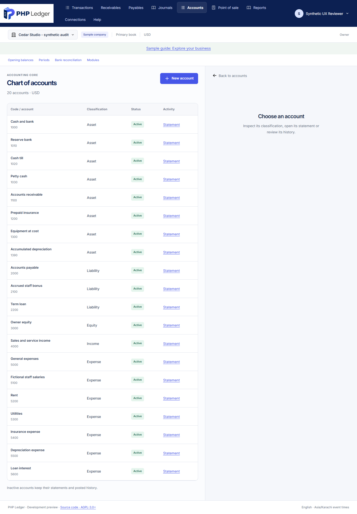

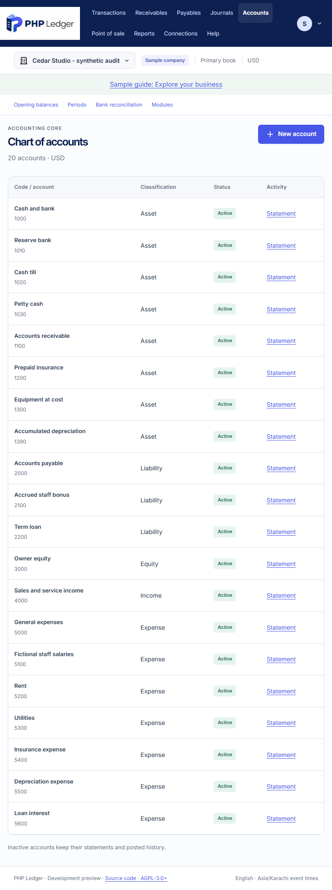

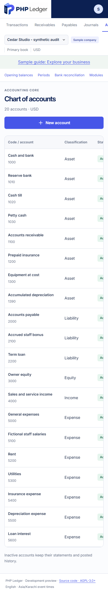

### 2. Trace an account statement - strong accounting context, heavy small-screen layout

**Route/context:** `/reports/account?id=5511`, Cedar Studio cash/bank, all posted history through 15 September 2026. The route parameter is `id`, not `account_id`.

**Strengths:** opening/debit/credit/closing totals, Dr/Cr explanation, per-line running balances, source and journal links, date filters and an explicit all-pages CSV action support traceability. The screen explains that sorting/searching do not recalculate historical running balances. The captured total is 41,935.00 Dr across 94 entries; this is observed fixture output, not an independently reconciled audit assertion.

**Friction:** the default starts at the oldest entries across all history. At 768px the table becomes tall cards, producing a 7,348px page; at 390px it becomes 8,539px. The first phone viewport ends before the headline balances. Twenty-five rows and pagination at the very bottom make movement through years of history cumbersome.

**Responsive/accessibility:** cards keep descriptions, debit/credit labels and running balances readable without page overflow. Compact statement layout and a shorter default mobile page would reduce repeated scrolling. Search and period filters must preserve clear distinctions between filtered rows and full-period totals. Keyboard sorting, screen-reader announcement of filtered counts and CSV contents were not tested.

**Capture note:** the first desktop capture raced table initialization and contained an artificial blank lower area; it was rejected. The accepted `ready` captures wait for network/font/layout readiness. Original rejected files remain outside this report's evidence directory.

Accepted screenshots: full desktop/tablet/phone and readable viewport details

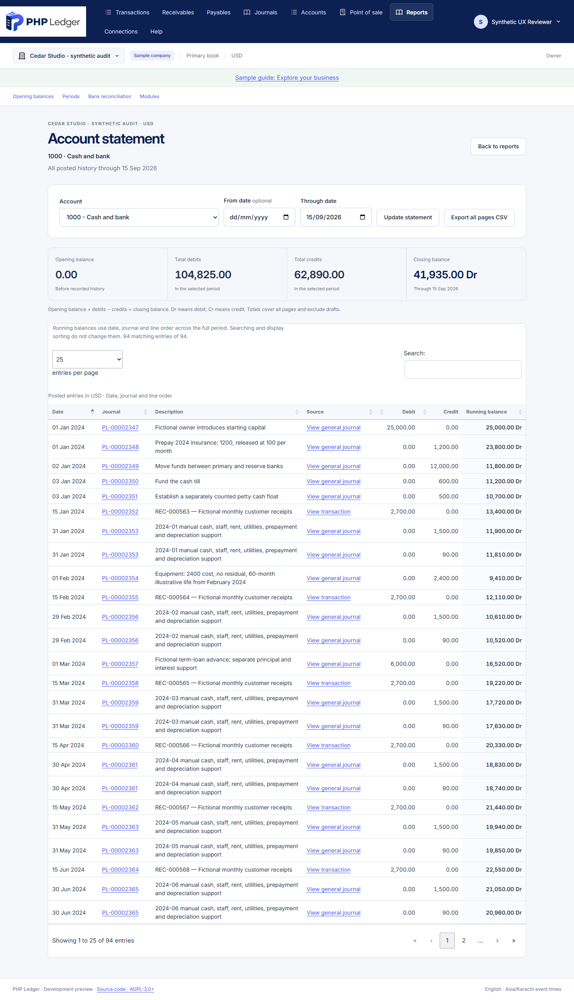

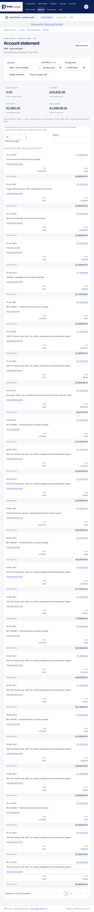

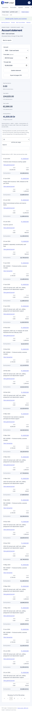

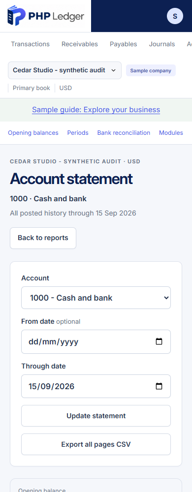

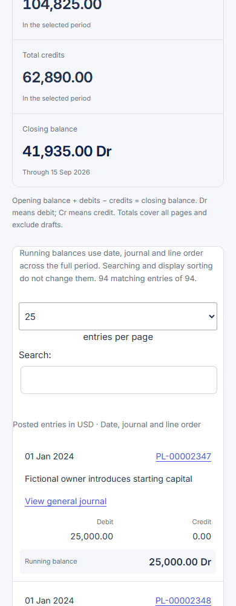

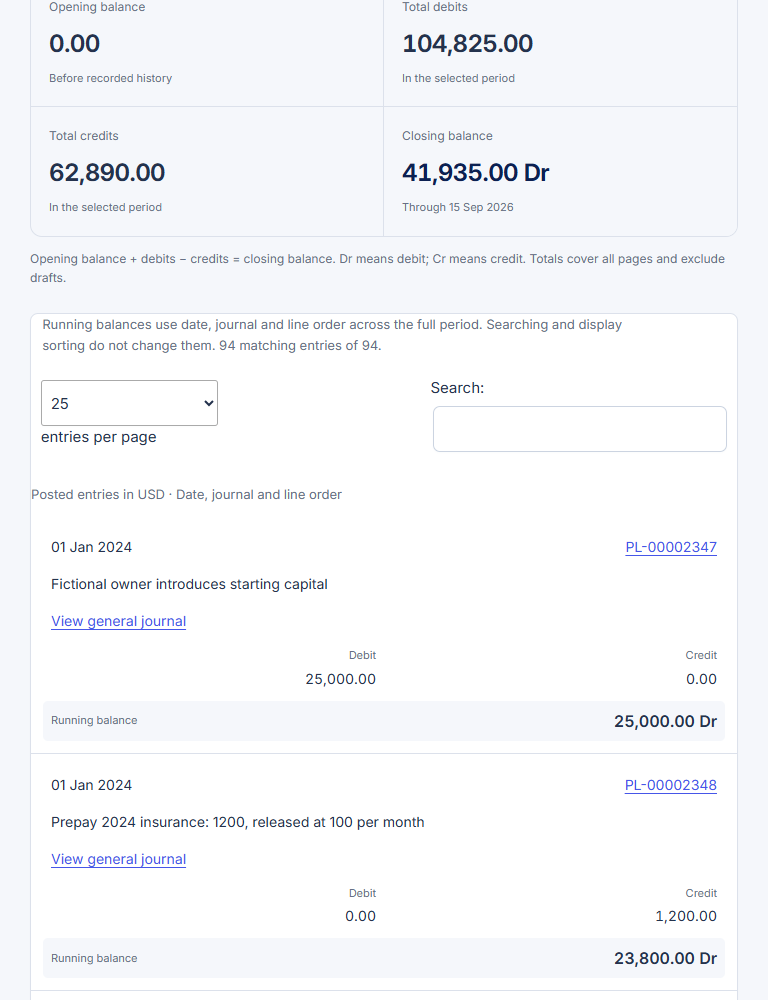

### 3. Find a report - clear owner language, missing shared reporting controls

**Route/context:** `/reports`, Cedar Studio. User wants cash, profit, financial position or an account drill-down.

**Strengths:** question-led cards explain balance sheet, profit/loss and a cash scenario; currency, posted-only basis and reporting dates are visible. Cash/bank explicitly aggregates several accounts. Totals accompany the small bar graphic, so colour alone does not carry its meaning.

**Friction:** the hub uses the full history from January 2024 to the current server date without a visible period selector. Trial balance and account ledger sit below three large cards, especially far down on a phone. The primary New transaction button competes with the report-selection task. Clicking the cash summary leads to financial position rather than a focused cash-account breakdown. AR/AP ageing and inventory/GRNI reconciliations are not available as report cards here.

**Responsive/accessibility:** cards reflow cleanly with no page overflow. Tablet/phone stacking adds scrolling and places technical reports near the bottom. Small muted explanatory text needs contrast measurement before sign-off; visual inspection alone cannot establish compliance.

**Next design criterion:** common period controls and a compact report chooser should expose owner summaries and reconciliation/ledger routes while preserving posted-only and scenario distinctions.

Accepted screenshots: desktop, tablet, phone

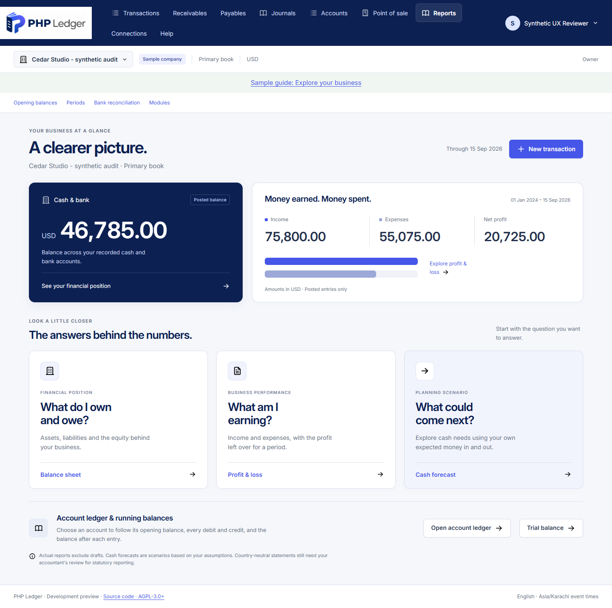

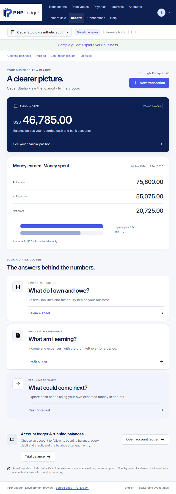

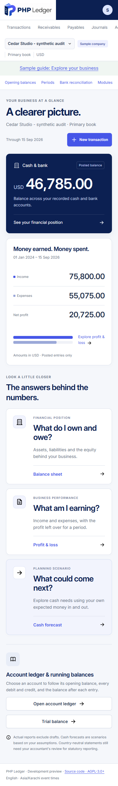

### 4. Review profit and loss - readable totals, weak drill-down affordance

**Route/context:** `/reports/profit-loss`, Cedar Studio, 1 January 2024 through 15 September 2026.

**Strengths:** separate income/expense sections, net profit, date fields, CSV action and an explicit arithmetic summary make the statement understandable. The explanation distinguishes profit from cash and includes dated reversals. Account codes and names remain visible.

**Friction:** the page defaults to the business's full multi-year history rather than a familiar current reporting period. There are no visible this-month/year or prior-period comparison choices. Account labels look like ordinary text, weakening the path from an expense total to its transactions; the follow-up click in step 14 confirms that the existing drill-down works and preserves dates.

**Responsive/accessibility:** two desktop sections stack into a readable single column on tablet/phone, with no page overflow. Phone dates/actions and totals remain legible. Small account codes and low-emphasis explanatory text need measured contrast and zoom testing. This capture does not test an invalid date range, export or report navigation with a screen reader.

**Next design criterion:** preserve the selected period across report-to-account drill-down; provide familiar period presets and clearly interactive rows without changing report accounting.

Accepted screenshots: desktop, tablet, phone

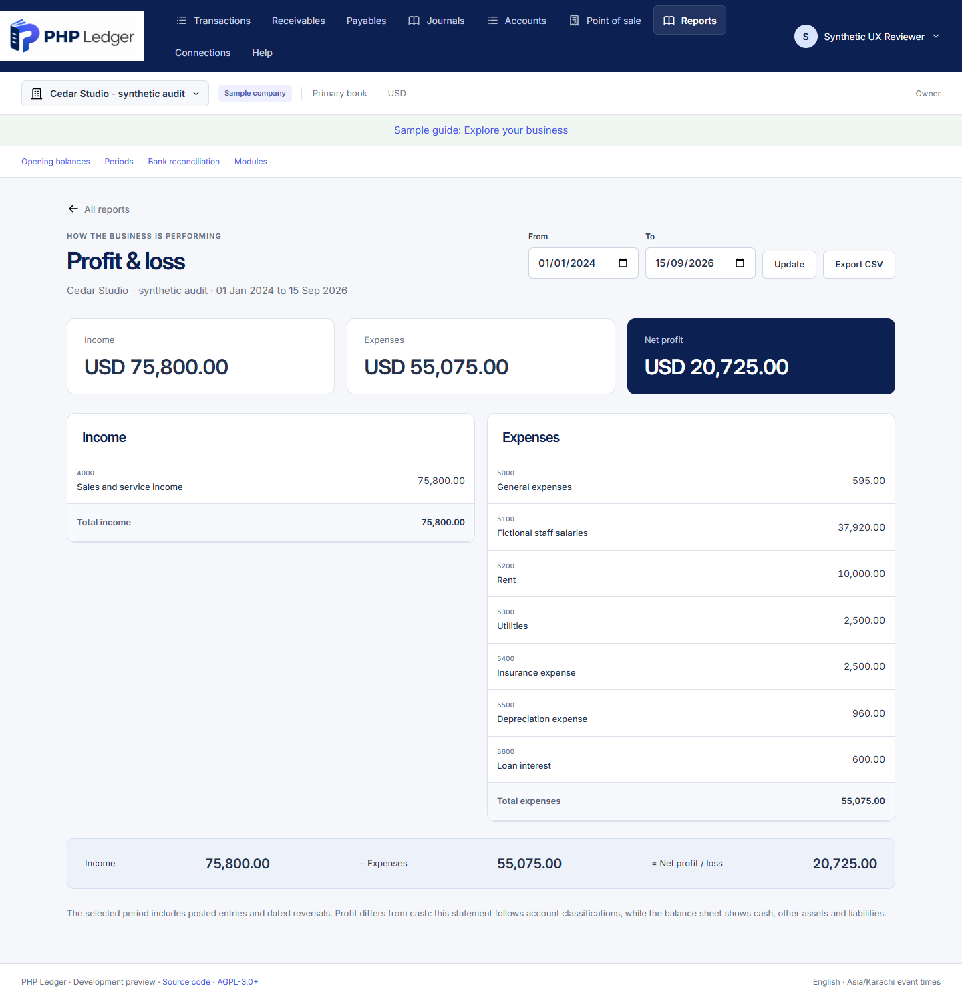

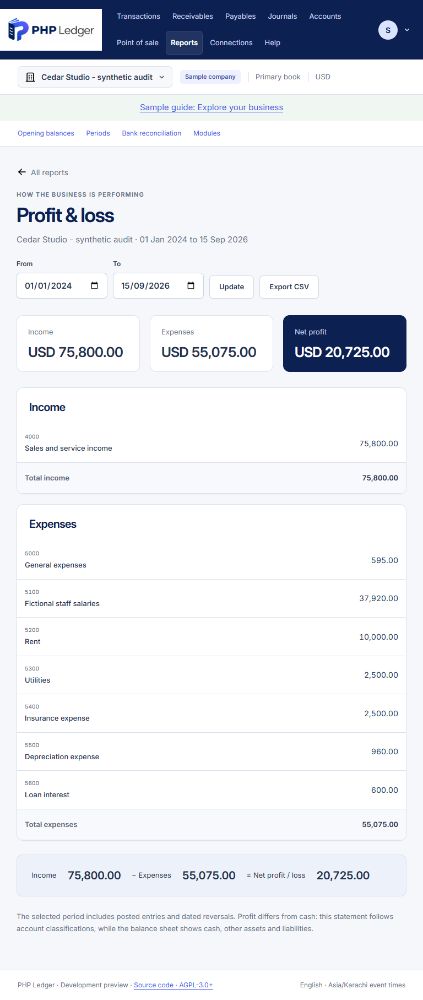

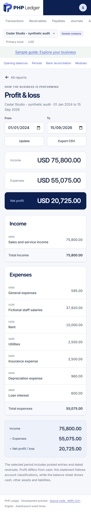

### 5. Review financial position - coherent statement, dense hierarchy

**Route/context:** `/reports/balance-sheet`, Cedar Studio, as of 15 September 2026.

**Strengths:** assets/liabilities/equity totals, account detail, earned-profit explanation and the explicit accounting equation provide a clear review structure. The screen correctly qualifies that balanced totals alone do not establish correct books. Negative accumulated depreciation remains visible rather than being hidden.

**Friction:** all accounts, including zero balances, share the same visual weight. There is no current/noncurrent or reviewed reporting-group hierarchy, comparison column, or visible hide-zero choice. The top equity value wraps its currency on the phone. Account links again resemble static text; source inspection confirms both balance-sheet and P&L names actually link to `/reports/account`, carrying the report dates. This is an affordance weakness, not a missing backend drill-down.

**Responsive/accessibility:** three columns become a readable stack. No page overflow occurs, but the equation and qualification appear only after a long phone scroll. Preserve the visible text equation alongside its green styling; colour should not be the only review signal. Keyboard/focus behaviour of statement links remains to be tested.

**Next design criterion:** make drill-downs discoverable, keep financial-position date context, and add hierarchy only through reviewed metadata rather than guessed country classifications.

Accepted screenshots: desktop, tablet, phone

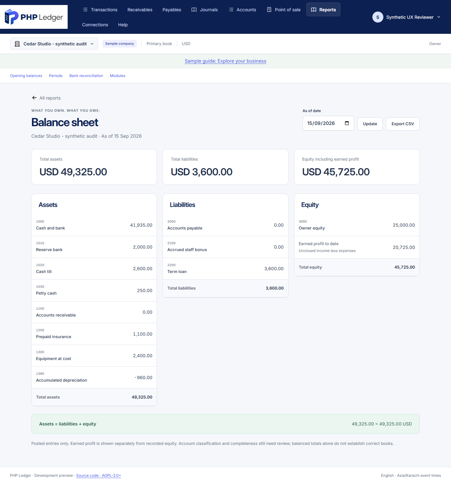

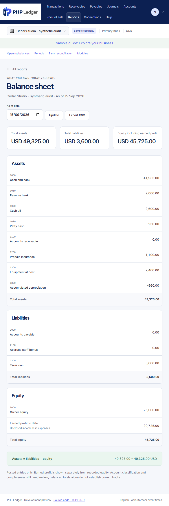

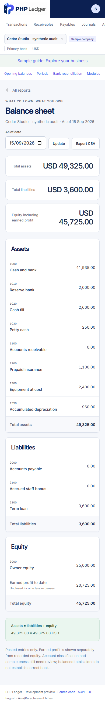

### 6. Check the trial balance - useful desktop view, phone filter defect

**Route/context:** `/reports/trial-balance`, Cedar Studio. User checks debit/credit equality and drills into accounts.

**Strengths:** underlined account links are discoverable; the posted-only explanation, account codes, separate debit/credit columns and qualification of equal totals are appropriate. Tablet rendering remains readable.

**Friction/confirmed defect:** at 390px the Through date label and input extend beyond the **left** viewport edge. The browser's document-width check still reports390px, so a no-horizontal-overflow check alone misses this clipping. The table's Credit column also lies outside the initial phone view, weakening a side-by-side equality check. The Back to transactions action differs from the other reports' All reports action.

**Responsive/accessibility:** the offscreen date control is a priority repair; users should not need to discover an inaccessible negative horizontal offset to set the report date. The table needs a clear horizontal-scroll cue or a compact readable alternative, and a visible top-level debit/credit/difference summary. The tiny agreement badge below twenty rows should not be the only status cue.

**Next design criterion:** at 390px and 200% zoom every filter remains fully reachable, both totals/difference are available before the long list, and back-navigation returns to the report task. No report values were changed in this capture.

Accepted screenshots: desktop, tablet, phone

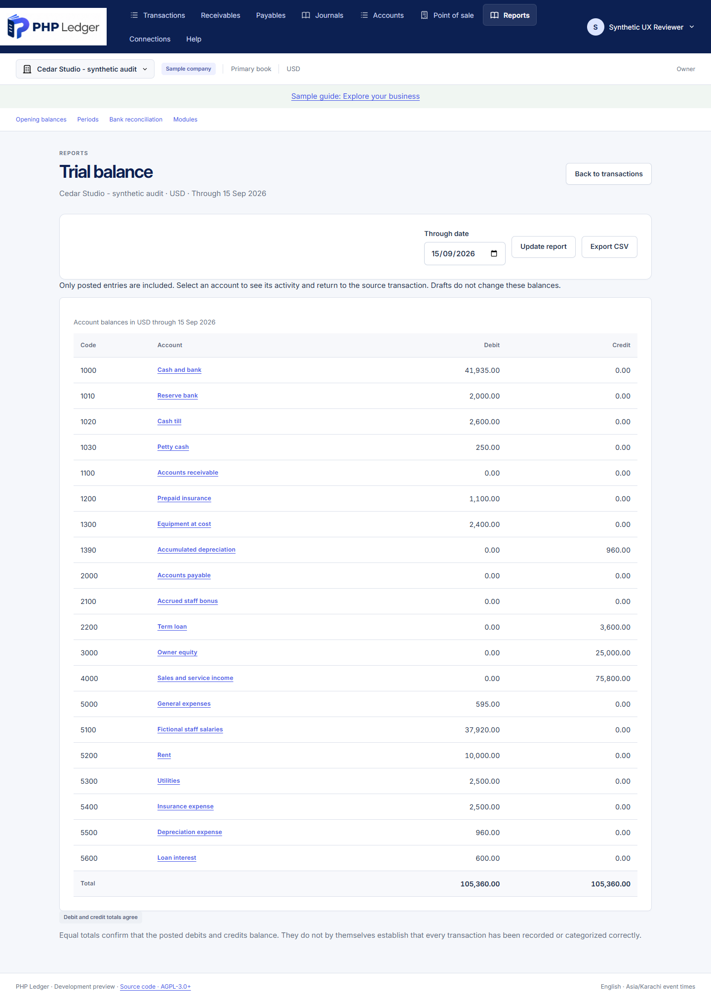

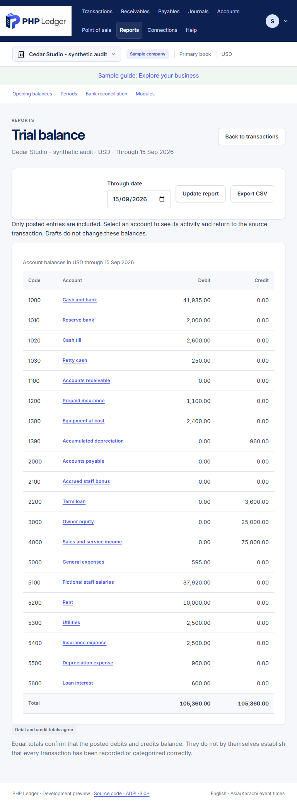

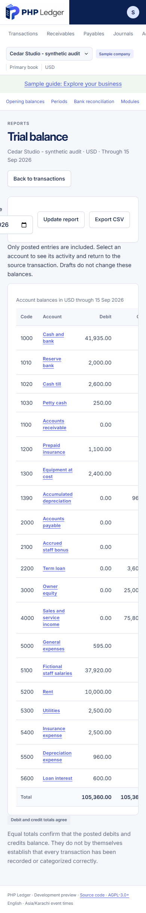

### 7. Explore a cash scenario - honest scope, small-screen chart/table weaknesses

**Route/context:** `/reports/cash-forecast`, Cedar Studio, illustrative weekly inflow 250 / outflow 175 over 12 weeks.

**Strengths:** the screen clearly labels this a planning scenario, shows starting posted cash, editable assumptions, projected closing cash and a week-by-week table. It explicitly says receivables timing, seasonality, taxes and unrecorded commitments are not included, and that the scenario does not post entries.

**Friction:** a large nearly flat graph conveys little change for this fixture; no saved/named scenario or comparison is visible. On a phone the table's outflow/closing columns are outside the initial view, while the chart's axis labels become very small. The repeated weekly assumptions cannot represent a seasonal month-by-month business without additional, explicitly scoped work.

**Responsive/accessibility:** assumption controls remain readable and the main page has no horizontal overflow. A textual projected result and detailed table provide alternatives to the chart, but those alternatives need readable small-screen access. No scenario submission, validation error, keyboard chart interaction or screen-reader chart description was tested.

**Next design criterion:** keep the explicit manual-scenario boundary; use readable chart labels and compact weekly rows, and make a missing/negative-cash condition understandable without relying on chart colour.

Accepted screenshots: desktop, tablet, phone

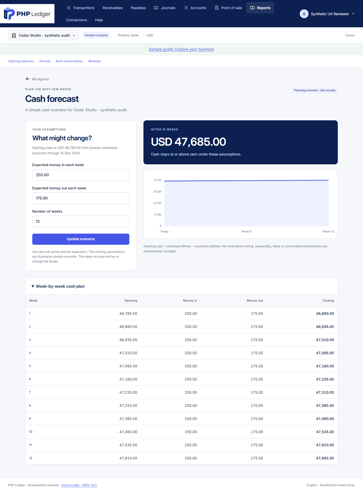

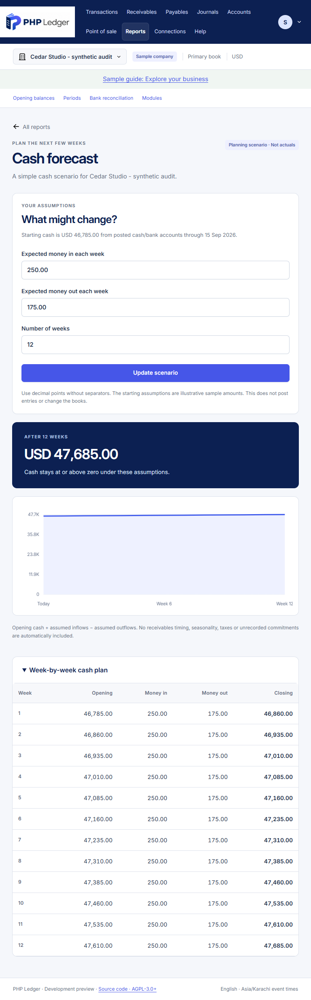

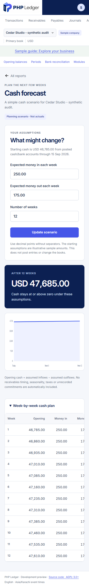

### 8. Begin bank reconciliation - cautious import contract, empty review lane

**Route/context:** `/bank-reconciliation`, Cedar Studio. No statements exist in this fixture; this captures the entry/empty-history state only.

**Strengths:** currency, CSV format/limits, statement period and balances are explicit. The first-statement checkbox exposes the cleared-baseline assumption rather than silently accepting earlier outstanding items. The primary action is Preview statement, not an immediate import/post.

**Friction:** a long technical CSV specification precedes every input. No downloadable example, account-specific current reconciliation status or guided first-baseline explanation is visible. Both paste and upload choices occupy the main form. A new user must understand the long baseline checkbox before seeing a concrete comparison.

**Responsive/accessibility:** the form stacks cleanly on a phone with readable labels and no page overflow. The small checkbox plus a multi-line consequential statement needs a generous clickable label, keyboard and error-association verification. File parsing, preview errors, match suggestions, manual matching, completion and cancellation were not exercised because this lane was read-only and the fixture had no statement history.

**Next design criterion:** show each account's last completed statement and next action; use a short prepare/preview/match/finish flow with an explicit first-baseline review. Preserve exact-amount matching, existing AR/AP settlement matching and no-double-post rules.

Accepted screenshots: desktop, tablet, phone

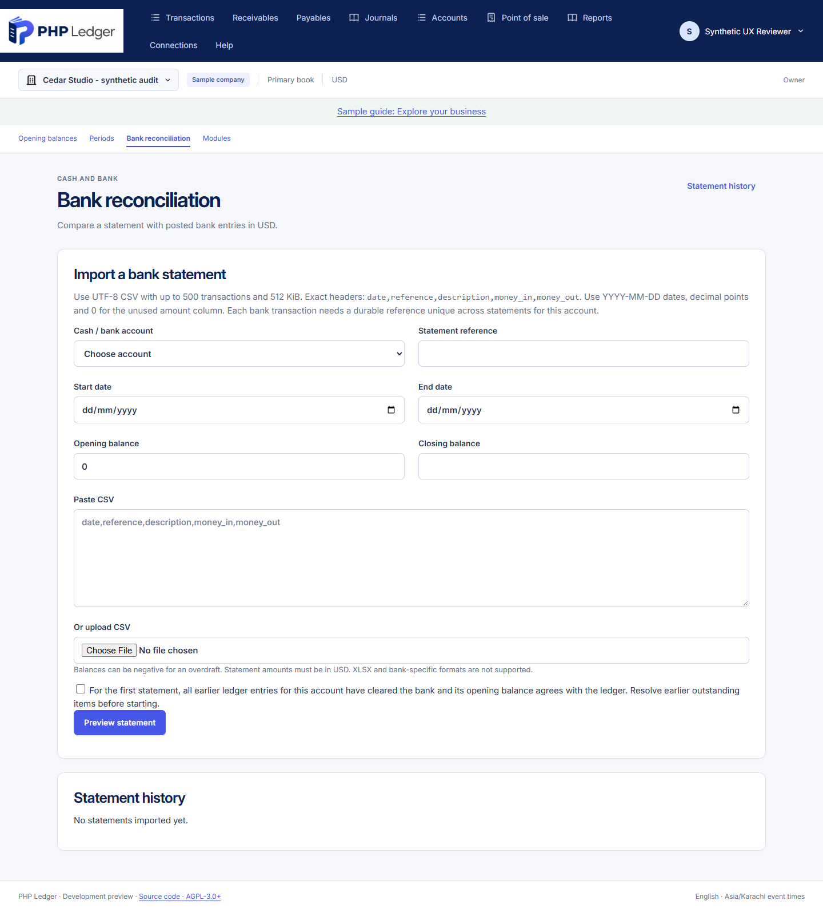

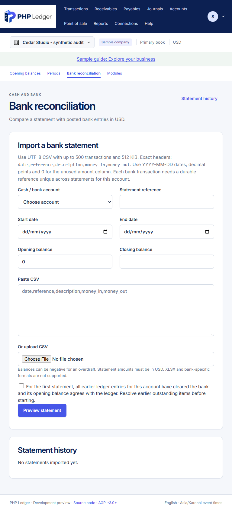

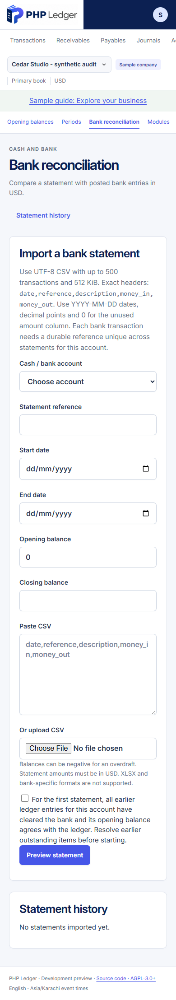

### 9. Review accounting periods - controls are explained, history is hard to scan

**Route/context:** `/periods`, Cedar Studio, closed historical periods and an open 2026 practice year.

**Strengths:** the introduction distinguishes posting-date closure from year-end adjustments, profit transfer or accounting approval. Close/reopen actions are collapsed rather than immediate one-click writes. The list shows date ranges and states; administration history retains reasons, actors and event times.

**Friction:** the history renders below the complete period list, with up to 100 actions and no visible filter/pagination. In this fixture the phone page reaches 9,295px. Its five-column history wraps reasons into narrow word stacks and pushes actor/time offscreen. A generic View reports link does not guide a bookkeeper through actual pre-close checks.

**Responsive/accessibility:** explanatory text and collapsed action labels are readable at 390px; the historical table is not efficient to read. Open/Closed text accompanies status styling. No close, reopen, create, reason validation or permission-denied submission was performed. Keyboard behaviour of disclosures and focus after a failed action need testing.

**Next design criterion:** group periods by year, show the active period and a compact review summary, and move searchable/paginated action history into a readable timeline or dedicated view. Keep owner-only reopening and service-enforced closed-period rules.

Accepted screenshots: desktop, tablet, phone and readable phone details

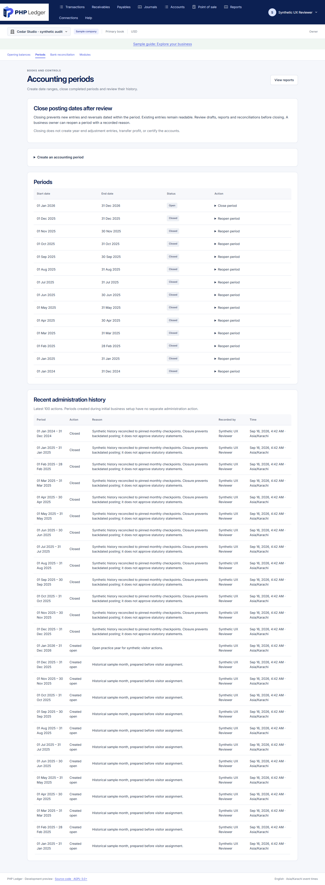

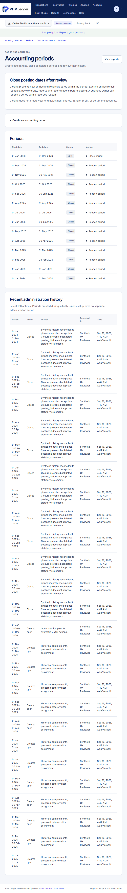

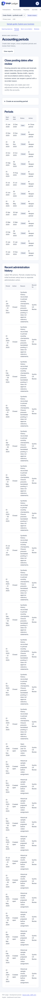

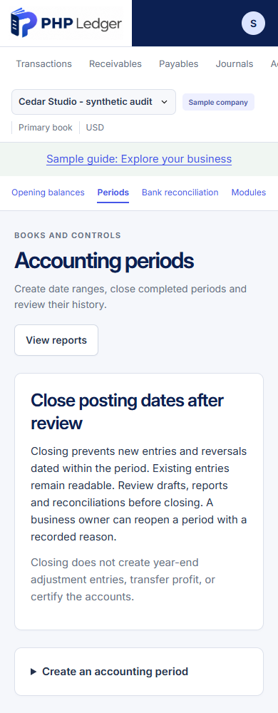

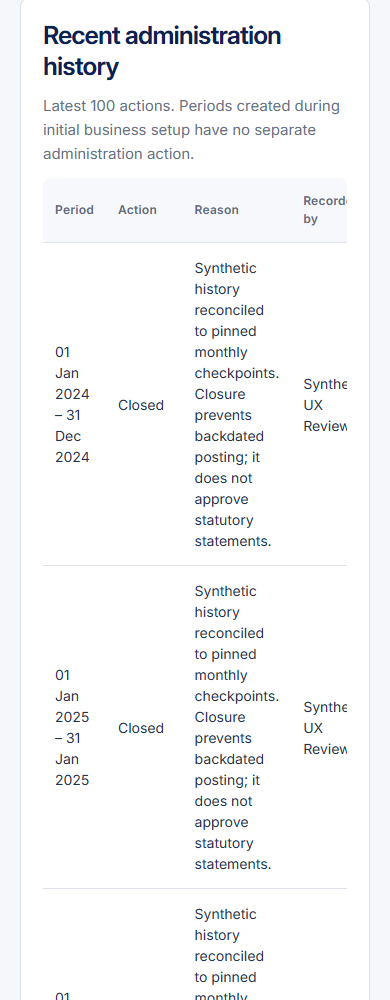

### 10. Configure tax - honest country-neutral boundary, form-heavy administration

**Route/context:** `/tax`, Starter Workshop, one synthetic DEMO5 rate and the default tax-exclusive price mode.

**Strengths:** the screen states that codes/rates are manual and excludes country rules, filing and forms. It explains the saved document's frozen price mode, the effect of a dated rate and the distinction between input/output tax accounts. Current default and immutable rate history are visible.

**Friction:** three full forms (price default, create code, add rate) precede the only existing-rate row. There is no compact code list showing each code's treatment, mapped accounts, current rate and next action. Switching inclusive/exclusive prices has no numerical example. The new-document default and per-document saved choice require careful reading. Secondary starter navigation repeats destinations already in the main navigation.

**Responsive/accessibility:** inputs stack successfully with no page overflow; on the phone the history's reason extends beyond the initial table view. Multiple identical Reason labels rely on section context. The six-decimal percentage display is exact but visually noisy for a simple 5% example. Keyboard section navigation, errors, owner permissions and changes to existing drafts were not exercised.

**Next design criterion:** show current configuration before edit/create actions, illustrate the price-mode difference, and review each rate/account change with its effective date and affected-new-document scope. Preserve frozen document snapshots and manual, jurisdiction-neutral behaviour.

Accepted screenshots: desktop, tablet, phone

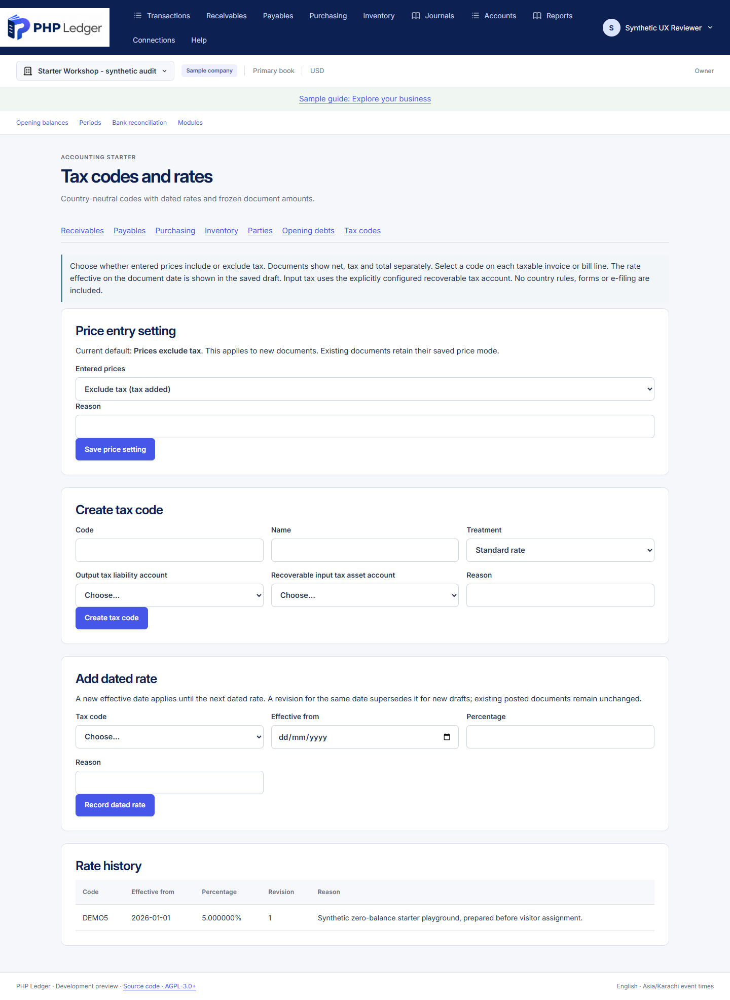

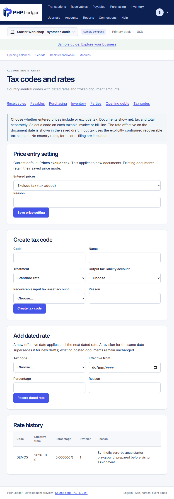

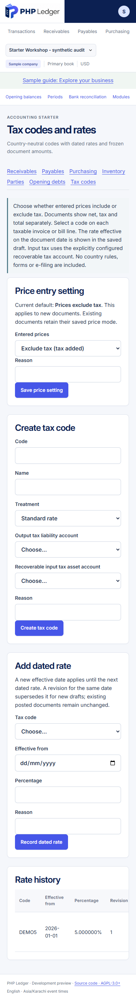

### 11. Choose optional modules - boundaries clear, dependency impact needs a review step

**Route/context:** `/modules`, Starter Workshop. Inventory/Purchasing enabled; cash POS showcase disabled; AR/AP navigation shown.

**Strengths:** the page clearly separates hiding AR/AP navigation from disabling optional operations. It states that core AR/AP remain available, existing financial totals/history remain intact and the POS showcase does not use Inventory. Module state, installed version, reason fields and recent changes are visible.

**Friction:** navigation preferences and operational activation share one long settings page. The Inventory card offers Disable while Purchasing is enabled, without an immediate visible dependency-impact explanation beside the button. Each card repeats history text and a full reason form. Recent changes start directly beneath the final card and their narrow phone table hides actor/time metadata.

**Responsive/accessibility:** cards stack without page overflow and state words accompany styling. The checkbox targets and repeated Disable module labels need keyboard/screen-reader context testing. No preference/module state was changed; any backend rejection of an invalid dependency transition was not exercised here.

**Next design criterion:** keep required/core services distinct from visibility preferences, show dependency consequences before confirmation, and preserve reasoned owner-only changes and historical reads. Avoid presenting a hide-navigation choice as removing an accounting capability.

Accepted screenshots: desktop, tablet, phone

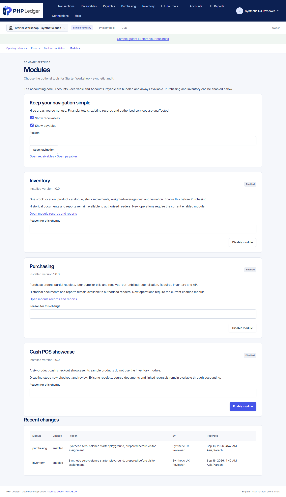

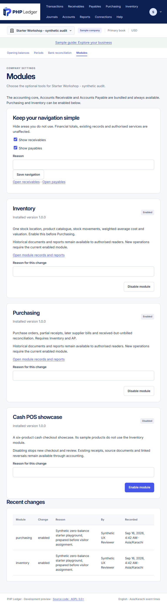

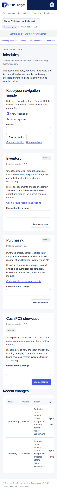

### 12. Understand reporting connections - scope clear, technical setup needs guidance

**Route/context:** `/connections`, Starter Workshop, no existing credentials. No token was created.

**Strengths:** the company/book and read-only nature are explicit. Expiry, revocation and the receiving client's handling of financial data are described. Separate credentials for private workflows and separate OAuth connections for shared-chat users are advised. The empty state does not imply a connected client.

**Friction:** Streamable HTTP, OAuth and tokens appear before a task-oriented choice or client-specific instruction. The endpoint is plain text without a visible copy action. The page exposes a numeric book ID while the human-readable Primary book label is already available. Broad connection-revocation wording needs a concrete impact review when a connection has multiple grants.

**Responsive/accessibility:** text and controls reflow cleanly at all three widths; the long placeholder clips in the phone input, although the visible Connection name label remains. A copy action should provide an accessible success message, not only an icon. Credential reveal, consent, token expiry, revoke confirmation and actual client access were not exercised.

**Next design criterion:** present a clear private-token versus supported-client/OAuth choice with explicit company/book scope, copyable endpoint, and useful empty/history states; retain read-only access and no automatic external connection.

Accepted screenshots: desktop, tablet, phone

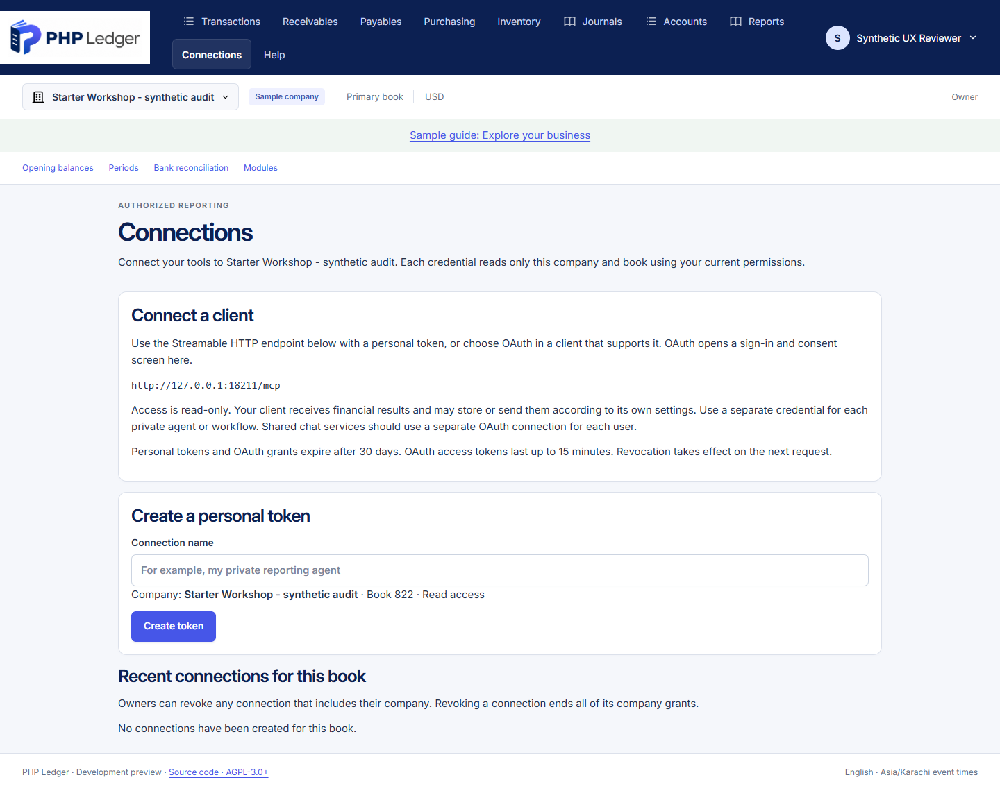

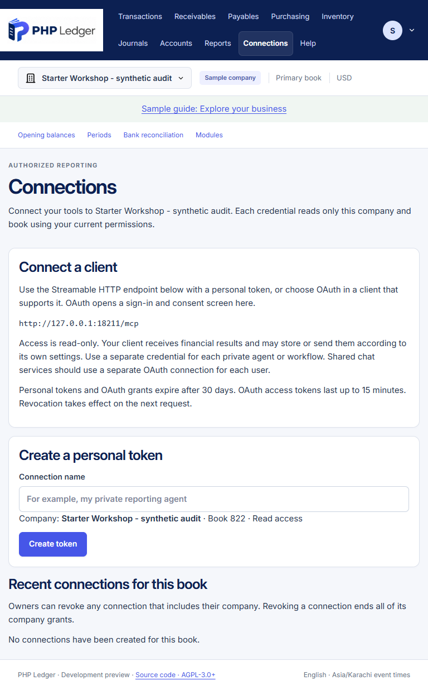

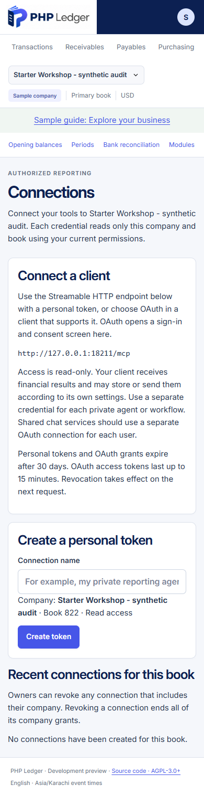

### 13. Recover from invalid authorization - clear focus, wrong recovery emphasis and phone clipping

**Route/context:** `/oauth/authorize` without an OAuth request. This is the deliberately requested invalid-request state, not a valid consent flow.

**Strengths:** the screen rejects the incomplete request, exposes no credential, gives a conspicuous focused error panel and offers return/help actions. It does not silently authorize a client or redirect to an unverified address.

**Friction/confirmed defect:** the message requires authorization-code/PKCE/state/redirect/resource parameters, but the generic recovery text advises checking business permissions. That is unlikely to resolve a malformed client request. At390px the primary Return to your businesses button extends beyond the left viewport edge; the measured page width still appears valid.

**Responsive/accessibility:** the error explanation wraps readably and visible focus is a strength. The clipped recovery action is a priority repair. Error focus/announcement needs screen-reader validation; the currently focused panel alone does not prove an announcement. Valid consent, denial, client redirect and scope review were not tested.

**Next design criterion:** distinguish an invalid client request from access denial, provide a useful client-setup/restart path, and keep both recovery actions inside the phone viewport without weakening OAuth validation.

Accepted screenshots: desktop, tablet, phone

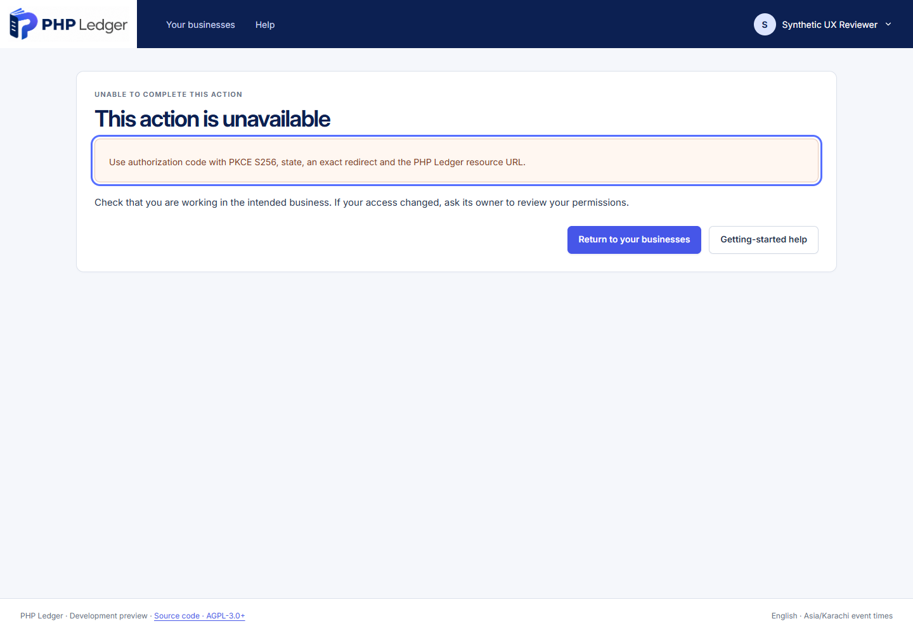

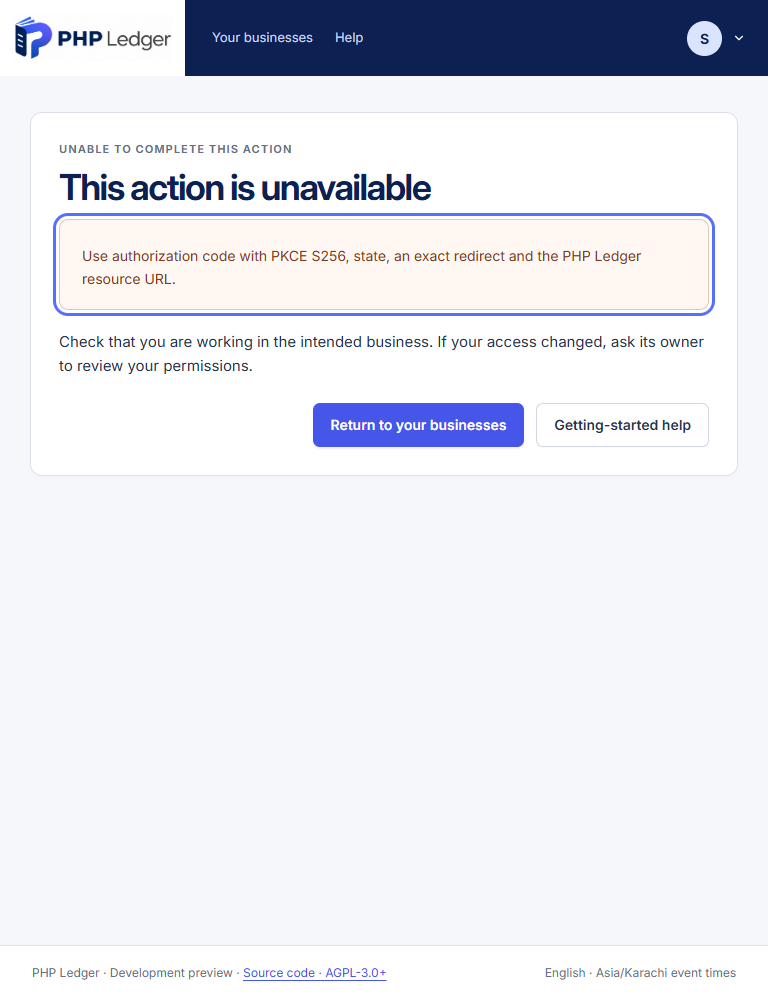

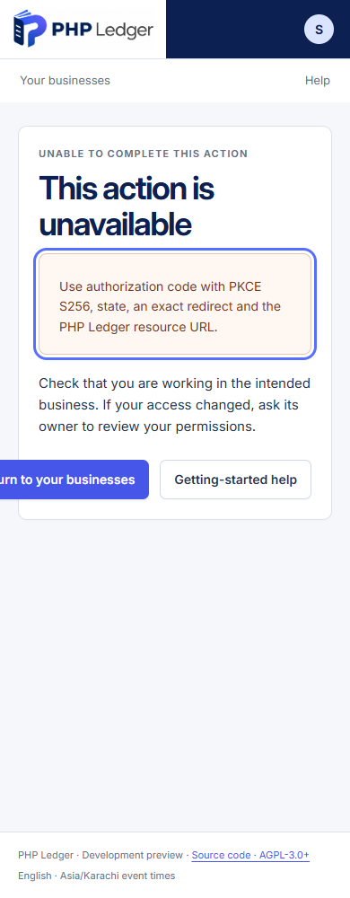

### 14. Follow a period result to its account - successful date-preserving drill-down

**Route/context:** after opening P&L with `from=2025-01-01&to=2025-12-31`, clicked its observed Sales and service income link. The resulting URL is `/reports/account?id=5515&as_of=2025-12-31&from=2025-01-01`.

**Observed result:** both dates survive, the account is correct and the statement shows 24 matching entries. The period credit total is 36,000.00, separately from opening 36,800.00 Cr and cumulative closing 72,800.00 Cr. This confirms a useful existing report-to-account interaction; it does not independently validate the fixture's accounting.

**Design consequence:** improve the original statement row's link styling and keep the distinction between period movement and cumulative closing balance. Back to reports currently returns to the generic hub rather than an explicit breadcrumb to the originating period P&L. The same tall-card behaviour remains at 768/390px. No transaction was edited or posted.

Accepted screenshots: desktop, tablet, phone

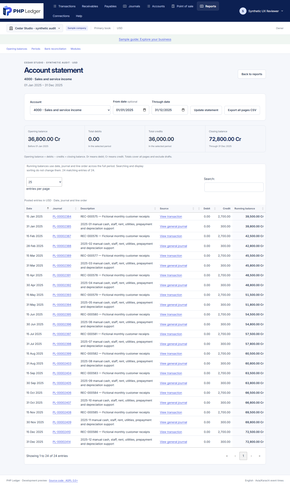

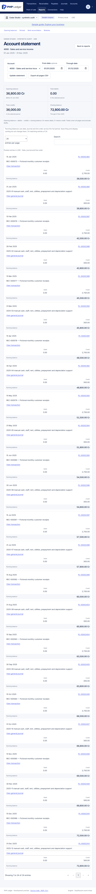

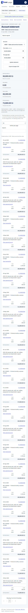

## Priority and acceptance criteria

Severity here describes observed task friction, not a security/accounting defect score. P1 items should be resolved before the redesigned lane is accepted; P2 items are the next usability improvements. These are proposed acceptance criteria, not claims of work completed.

| Priority | Finding / evidence | Acceptance criterion |
|---|---|---|
| **P1** | Offscreen date control (step6) and recovery button (step13) | At390px and at 200% browser zoom, every visible filter and primary recovery action has a nonnegative left edge and fits or intentionally wraps. Test element rectangles as well as document width. Keyboard focus must remain visible. |
| **P1** | Mobile chart/statement/history data hard to reach (steps1,2,6,7,9-11) | A user can find the account, period, both sides of a balance and the relevant action without unexplained lateral scrolling. Where a table must scroll, provide a visible cue, keyboard access and preserved row/column context. Use shorter page sizes or compact rows on small screens. |
| **P1** | Reporting context is spread across pages (steps3-6,14) | Choose a familiar period once; report heading, drill-down, export and return path retain that same company/book/currency/date context. Period movement and cumulative balance remain visibly distinct. |
| **P1** | Reconciliation has no populated workflow evidence in this fixture (step8) | Before final UX acceptance, capture a prepared synthetic statement through preview, existing-AR/AP-payment matching, unmatched difference, completion and retained history. No action may post an already-recorded payment again. |
| **P1** | Tax/module/period changes need clearer impact review (steps9-11) | Show current state first, affected future operations and dependencies, then explicit confirmation/reason. Declined or stale changes preserve input and current state. Do not confuse AR/AP navigation visibility with service disablement. |
| **P1** | Invalid OAuth recovery points to permissions (step13) | Distinguish malformed request, expired request and denied access with specific safe recovery. A malformed request never redirects to an untrusted client; technical detail can expand beneath the plain-language reason. |
| **P2** | Reports and settings require long scrolling (steps2,3,9-11) | Put the primary answer/current configuration near the top; group advanced details, paginate/filter history and keep the next action discoverable. Preserve audit history instead of truncating it invisibly. |
| **P2** | Weak financial-statement link styling (steps4,5,14) | Account rows look and behave like links, with visible focus and context-preserving drill-down. The row's meaning must not depend on colour alone. |
| **P2** | Shared navigation consumes space and hides current destination (all company routes) | A phone user can identify the active area and switch between daily work, reports and administration without hunting through a clipped horizontal list. The company/book context remains explicit. |
| **P2** | Small graph/metadata and repeated technical wording (steps7,8,10,12) | At each audited width, labels stay readable; exact details remain available through focused disclosure. State limitations near the relevant decision, with concrete examples for price modes and statement formats. |

### Proposed lane flows

1. **Owner report:** choose business and period -> read cash/profit/position -> select an account -> inspect movement/source -> return to the same report context.
2. **Reconciliation:** choose bank and statement period -> establish/review first baseline -> preview file -> match existing entries -> explain differences -> confirm completion -> inspect retained receipt/history.
3. **Period review:** choose period -> review linked drafts/reports/reconciliations -> record a closure reason and confirm -> retain state/history; owner-only reopening remains a separate action.
4. **Tax administration:** inspect current codes/rates/price default -> choose a bounded edit -> see numerical/effective-date consequences -> confirm with reason -> retain version history and document snapshots.
5. **Module administration:** distinguish required services, visibility preferences and optional operations -> inspect dependency impact -> confirm -> retain historical reads.
6. **Connections:** choose a supported connection method -> review company/book and read-only access -> explicitly create/consent -> inspect expiry/revoke impact. Invalid requests have a separate safe recovery path.

## Backend boundaries for the redesign

The proposed visual changes must reuse the existing router, shared bootstrap, MeekroDB connection, access checks and typed services. No new posting, permission or configuration subsystem is implied.

- **Report reads:** `public/index.php` already passes `from`/`to` or `as_of` into shared reporting functions; account statements use `id`, `from`, `as_of` and pagination. P&L/BS templates already preserve dates in account links. Reuse this behaviour and centralize presentation/filter state rather than inventing alternate report calculations.
- **Account identity:** code, root type and role are fixed after account creation; display-name/status changes are audited. A convenient chart editor cannot silently reclassify accounts or rewrite posted history.
- **Bank reconciliation:** the existing browser adapter separates preview, import, match/unmatch, complete and cancel. It checks browser scope/CSRF, retains a scoped preview and delegates to services with revisions and durable identities. Completion protects the reconciled bank date. The redesign must surface these stages and preserve exact shared-payment matching.
- **Periods:** existing create/close/reopen services own permissions, revisions, reasons, date overlap and posting guards. A front-end checklist does not substitute for those rules or imply year-end statements are approved.
- **Tax:** existing services own manually configured codes, dated rates, explicit account mappings, price-mode revisions and frozen document calculations. The starter dispatcher and global request handling supply scope/CSRF boundaries; a country label does not activate tax rules.
- **Modules:** the existing registry, dependency checks and owner-only mutations remain authoritative. AR/AP navigation preferences affect visibility; they do not remove balances from reports or disable required services.
- **Connections:** use the existing token/OAuth contracts, scoped reads, expiry and revocation. Improving instructions must not add automatic external calls, financial write authority or a new authentication path.

### Setup/migration criteria for the companion design

Source inspection, separate from this lane's visual evidence, found the current `/onboarding` preview/confirmation, existing/fresh/sample choice, `/opening-balances` and `/opening-conversion` paths. The following acceptance criteria should be combined with the root agent's setup captures:

- **P1:** fresh, bring-past-records and isolated-sample choices are visibly distinct; fresh confirmation cannot bypass unresolved opening balances, and synthetic sample data never enters a real company.
- **P1:** show exact company/book, functional currency, start date and pinned template before confirmation; preserve the existing digest check, durable setup identity and stale-preview recovery.
- **P1:** ambiguous chart/party/product mappings and any control difference block confirmation with field/source-specific next actions. Do not silently guess an account or create a balancing plug.
- **P1:** opening GL posts once; AR/AP and stock conversions explain and allocate that existing basis. The UI must distinguish opening confirmation from later operational activation, preserving source evidence and no-double-post guards.
- **P1:** installation success and financial readiness are separate states. Existing businesses continue to opening work; do not land them in a ready-to-post view prematurely.
- **P2:** keep entered values and show a clear resume path after validation; state uncertainty explicitly and allow a deliberate neutral-only path under the proposed catalogue contract.

## Verification, limits and handoff

- **Accepted evidence:** 47 unchanged PNGs: 13 requested route states at three widths, one date-preserving report drill-down at three widths, and five readable viewport details for long pages. Every accepted image was opened and inspected. The rejected first statement capture is retained only in the original output directory and is not linked as evidence.
- **Geometry:** all 42 full-route captures reported document width equal to viewport width and no page-JavaScript errors. This did not detect negative-left clipping; follow-up element measurements found the trial-balance date field at x=-85.08px and the OAuth recovery action at x=-41.47px on 390px screens. Trial-balance table scrolling is focusable (`tabindex=0`), a useful existing foundation.
- **Errors:** the deliberately invalid OAuth request returned 403; its focused error panel has `role=alert` and `tabindex=-1`. An initial local favicon request returned 404. No PHP fatal/warning/stack-trace text appeared in the captured pages.
- **Interaction exercised:** independent login/session initialization; explicit switching between two synthetic companies; direct report/settings navigation; read-only 2025 report filter URL and an actual P&L account-link click retaining both dates.
- **Not exercised:** bank import/matching/completion, account creation/editing, period mutation, tax/module settings changes, credential creation/revocation, valid OAuth consent, exports, screen-reader use, full keyboard traversal, contrast measurement,200% zoom or observed uncoached user testing. These remain acceptance work; screenshots alone cannot close them.
- **Scope:** documentation/evidence only. No migrations, schema changes, application changes, accounting mutations, raw secrets, external provider actions or production changes. Local HTTP/browser session writes are the only runtime interaction.
- **References read:** current router and setup/account/reporting/period/reconciliation/tax/module services/templates; existing starter/COA design boundaries; Product Design audit and Playwright guidance. No Google Drive reference was used or edited.

Next: review these findings alongside the other route lanes and proposed workflow screens, then agree the bounded implementation pass and missing populated-state acceptance fixtures.
